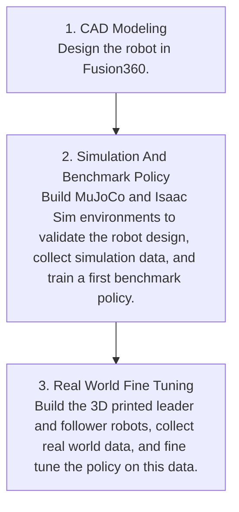

# Hepha

TODO: Explain why you did not use LeRobot directly.

Hepha is a robotics project where I try to reproduce a simplified pipeline for building a humanoid-like robot.

The goal is to play with these technologies and give you a sense of how humanoid robots work.

The project builds a robot made of a CNC base and an upper body with robotic arms. The goal is to make it perform a simple warehouse-like task: place or remove a foam cube from drawers.

This document explains the full pipeline: CAD design, 3D printing, robot assembly, MuJoCo and Isaac Sim / Isaac Lab simulation, synthetic data generation with inverse kinematics, policy training, and later fine tuning with real world data.

To go further, I also explore a more complete company integration system around the 
robot. The idea is to connect the robots, the ERP system, and the RAG to a central coordinator, so that a company could control many robots from one chat while keeping the ERP and RAG updated live based on the robot actions.

Finally, I will share my perspective on the field, based on my experience: the promising areas of research, and the challenges that still remain.

This document was polished using AI, but the goal is to keep the text simple and close to my own words.

It is not a finished product or a review paper, so please forgive the lack of details. It is a practical project report about what I built, what I learned, and what still needs to be done.

PS: I made a summary video of the document here: **TODO: link to video**.

PS: The project is called **Hepha**, like Hephaistos, the Greek god of tools, 
craftsmanship, and invention.


## Table of Contents

1. [Brief Words About Me](#brief-words-about-me)
2. [Before Starting](#before-starting)
3. [Why General Purpose Robotics Is Hard](#why-general-purpose-robotics-is-hard)
4. [Pipeline Overview](#pipeline-overview)
5. [Step 1: CAD Modeling](#step-1-cad-modeling)
6. [Step 2: Simulation And Benchmark Policy](#step-2-simulation-and-benchmark-policy)
7. [Step 3: Real World Fine Tuning](#step-3-real-world-fine-tuning)
8. [Conclusion](#conclusion)
9. [Going Further](#going-further)
10. [Perspective](#perspective)
11. [References](#references)
12. [Citation](#citation)

## Brief Words About Me

I am a passionate machine learning engineer from Switzerland.

For the past five years I have played with robotics: Arduino, Raspberry Pi, CAD software, CNC systems including 3D printers, servo motors and stepper motors, actuators, radios, GSM modules, and, well, electronics in general.

I then used my machine learning background to train policies on the cloud and make hardware move intelligently.

And it is so much fun, you will see.

## Before Starting

If you don't have experience in robotics yet, I recommend you to have a 
look at the LeRobot project.

LeRobot is an open source project from Hugging Face that helps you build a 3D printed robot and run a machine learning policy on it.

**TODO:** add a GIF of my own LeRobot robot and a PushT policy demo.


I also encourage you to create your own policies in LeRobot. A custom policy that I 
really liked is the [DOT policy](https://github.com/IliaLarchenko/dot_policy) 
from Ilia Larchenko. It helped me well to understand the ACT policy and its 
limitations.

If you want to stay on your computer, without a 3D printed robot, you can also train policies in virtual tasks, for example the PushT task trained in a Gym environment.

**TODO:** add GIF of my PushT policy demo.

LeRobot has evolved from a small imitation learning library into one of the most 
complete open-source robotics frameworks. It now contains implementations of 
many SOTA models for imitation learning, reinforcement learning, 
Vision-Language-Action models, world models, and reward models.

I will mention and use some of these models: ACT, Diffusion models, VLA 
(Vision-Language-Action), and JEPA.

### Prerequisites For This Project

1. **CAD**: familiarity with CAD software such as Fusion360, FreeCAD or SolidWorks.
2. **Simulation engines**: MuJoCo from DeepMind, Isaac Sim from Nvidia.
3. **ML knowledge**: imitation learning (particularly behavior cloning) 
   reinforcement learning, ACT, diffusion models, VLA, JEPA.

## Why General Purpose Robotics Is Hard

Let me be clear: no, you cannot simply plug Claude Code, Gemini or ChatGPT into humanoid hardware and get a fully autonomous human-looking robot.

LLMs are very good at text, but the physical world is very different from text, and a lot more complex.

To get a sense of it, first note that for LLMs the amount of high quality training data available is incredibly large: the internet, billions of text examples. The space of English text to predict is relatively small: a few thousand common words or tokens.

General purpose robotics is very different.

The inputs are images, which are much more complex to analyze than text, possibly 
other sensor data: touch data, lidar data for depth, text, or audio commands from a human. Basically, any input your brain receives from your body.

The output is a set of servo joint coordinates, meaning actions of the robot in the physical world, and potentially voice if the robot should speak.

Unlike for LLMs, the amount of high quality robotics data, meaning sensor values and ground truth action pairs, is very limited.

Also unlike LLMs, where the prediction space is rather small and discrete, the action space in robotics is continuous, though it can be discretized, and immense.

As a result, even the best LLMs will not perform well if you simply plug them into your robot. It is also going to be very slow.

One needs models capable of understanding the mapping from world observations to 
actions, and vis-versa. I call them "world models".

Transformers (the main architecture of LLMs) might not even be the right 
architecture. To 
understand more why, see interviews and papers from Yann LeCun about world models:
- TODO: link interview NVIDA summit
- TODO: papers
He recently created AMI Labs, a start-up aiming to produce state of the art world 
models for real world applications.

To summarize, two important challenges of general purpose robotics today are:

1. **Data**: high quality ground truth observation-action pairs.
2. **Adequate models**: models capable of understanding the world and the surrounding physics, while still being very fast at inference.

### Data Challenge

To tackle the first challenge, good quality data, researchers use a mix of simulation and imitation learning episodes collected on the physical robot.

First, you train your robot in a virtual environment that mimics real physics, and hope the policy transfers to the physical robot. This is the sim-to-real problem.

Nvidia created Isaac Sim for exactly this purpose: to mimic real world physics accurately and create realistic simulations, running on Nvidia GPUs. MuJoCo serves a similar purpose. MuJoCo is more commonly used in research, less visually polished than Isaac Sim, but computationally more efficient because it can run on CPUs.

Simulation data is generally not enough to get a policy working outside the simulator. The policy usually needs to be fine tuned on episodes collected with the actual robot.

To collect these episodes, the robot must perform the task while a human or another system guides its movements. The robot being trained is called the follower. It records its observations and the corresponding ground truth actions.

This guiding process is called teleoperation. It can be done with another connected robot, called the leader, while the trained robot is the follower. It can also be done with a controller, although this becomes harder when the robot has many degrees of freedom.

**TODO:** add GIF of leader and follower + controller.

Teleoperation produces high quality ground truth data, but it is difficult to use it to collect millions of episodes. This is why simulation is used in the first place.

### Model Challenge

The research community is a bit divided on whether Transformer-like models can 
understand the world's physics well enough to be a solution for general purpose 
robotics.

Some big players are betting on scale: with enough data and compute, large models 
will be able to understand the 3D world.

Other researchers, like Yann LeCun, believe that current models are not designed 
to understand the world and the surrounding physics. They do not efficiently build useful representations of the world.

For example, to predict the trajectory of a ball from camera images, a Transformer may look at many irrelevant details in the image, such as the color of the sky or the background. This can be very inefficient.

World models are interesting because they seem closer to how the brain works. Before doing an action, for example fetching a spoon in the kitchen, your brain does not directly predict every muscle movement from the beginning to the end. It first plans at a high level: find the kitchen, find the spoon, come back. Then each of these steps can be decomposed into lower level actions. For "find the kitchen", this could mean stand up, rotate your body, scan the room, and walk toward the kitchen.

Each level requires a different type of intelligence. High level actions require reasoning and planning. Lower level actions are more mechanical, closer to reflexes, and must be very fast at inference. Also, before doing an important action, your brain can imagine your body doing it and predict what may happen without actually doing it. This is possible because the brain has some internal model of the world.

This is the intuition behind Yann LeCun's world model direction. He has proposed models like JEPA, Joint Embedding Predictive Architecture, as a possible foundation for world models. The idea is to learn useful representations of the world in an abstract embedding space, and to predict future states in this space instead of predicting every pixel directly. A robot could then reason inside this learned world representation before actually performing an action.

## Pipeline Overview

Now that I went through the project overview and the main challenges of general 
purpose robotics, let's deep dive into the project:



### Robot Description

The robot has 15 degrees of freedom.

The robot is composed of a CNC part and an upper humanoid body part with servo motors.

The CNC part is a CNC machine with stepper motors that I used to play with in 
previous projects:


The CNC part allows to place the upper humanoid body part in different work 
positions:


### Task Description

The task resembles a realistic robot task in a warehouse-like environment. Here I call "warehouse-like environment" any environment composed of zones where robots maneuver and zones where products are stored, placed, or picked from. Examples are traditional warehouses, supermarkets, pharmacies, greenhouses, or even vineyards.

A robot would navigate in the environment and use its robotic arm to place objects into storage, or remove objects from storage.

For brevity, this report will not discuss autonomous navigation in the warehouse-like environment, as this does not necessarily require a machine learning model. If you are curious, the robot base for navigation looks like this:


In what follows, I will assume the task happens in a traditional warehouse composed of drawers, with objects to place into or remove from the drawers.

You can generalize this task to many use cases. In a greenhouse, it could mean placing seeds or harvesting a product from a rack. In a supermarket, it could mean placing products on a shelf, but not removing them, since this is done by customers.

For simplicity, I purposely chose not to focus on the upper part of the humanoid 
robot and not on the legs at the moment. This is an approach also used by Genesis 
AI (**TODO:** add video).

All in all, the task description is:

> Given a request from the user to place or remove a product in or from a 
> warehouse, the robot should move its body and arms to perform the task, where:
>
> 1. I use a foam cube to represent the product for simplicity.
> 2. I use a stack of drawers to mimic warehouse racks.

## Step 1: CAD Modeling

Before building anything, I construct a 3D model of the robot.

This is required to validate the design, 3D print the robot, and build the simulation environment in MuJoCo and Isaac Sim.

For this I use Fusion360.


The path to the CAD project is **TODO**.

Each component is modeled as an assembly, possibly made of several sub-components:

```text
hepha-robot-cad
├── base
├── cnc_x
├── cnc_y
├── shoulder_l
├── shoulder_r
├── head
├── forearm_l
├── forearm_r
├── arm_l
├── arm_r
├── wrist_l
├── wrist_r
├── hand_l
├── hand_r
├── finger_l
├── finger_r
├── storage_rack
└── storage_bin
```

**TODO:** add GIF of the CAD.


From this CAD, the robot components were 3D printed and assembled, both for the leader and follower.

Since I do not have a CNC machine for the leader, I will use a controller to lead 
the CNC follower as explained later.

**TODO:** add GIF of the real robot.


## Step 2: Simulation And Benchmark Policy

As mentioned above, the lack of data is one of the two main challenges in general 
purpose robotics. For this reason, and also to validate the hardware, I first built 
a simulation of the robot that I designed. I will try both MuJoCo from DeepMind and Isaac Sim from Nvidia to compare the two.

### MuJoCo

MuJoCo is widely used in research. It is very easy to install and has a low 
learning curve. It is known to be computationally efficient for physics 
simulation, while still simulating robot dynamics accurately. You can run it on 
your local machine, while Isaac Sim requires GPUs. One important drawback of 
MuJoCo compared with Isaac Sim is that it does not produce photorealistic 
rendering. This can be useful when the model requires camera frames as input 
(which is the case for humanoid robot models).

#### From CAD To Robot Description

To create the MuJoCo simulation, I will use the Fusion360 plugin called 
`ACDC4Robotics` to transform a CAD representation into `.urdf`, or even into an `.mjcf` file specific to MuJoCo. These are robot description files. They contain 
not only the visual meshes of the components, but also the joint information between robot components, inertia, friction, center of mass, etc. All of this is required to produce a simulation faithful to reality.

To use `ACDC4Robotics`, I had to transform my original `hepha-robot-cad` project into a new project called `hepha-robot-sim`.

In the CAD project, components are organized like robot parts. In the simulation project, they need to be organized like robot links: one component per link, and only one body inside each link component.

To do this, I first created an empty component for each link. Then I copied the relevant bodies into each link component, combined them into a single body, and finally added the correct joint between the links, either `slider` or `revolute`.

**TODO:** add path to the `hepha-robot-sim` file.


#### Collision Geometries

The `.mjcf` file from the previous section only gives me visual mesh geometries with controllable joints. To obtain a physically realistic robot, I also need to activate physical collisions.

In MuJoCo, visual meshes are only used for visualization. The collision engine instead uses coarser and simpler geometries, which are faster and more numerically stable than arbitrary triangle meshes. These collision geometries are usually made from MuJoCo primitives such as boxes, spheres, and cylinders.

For each link in my updated Fusion360 `hepha-robot-sim` project, I had to create a 
coarse `.step` file made of primitive geometries. I decided to use only boxes. I 
then wrote a simple Python script to transform these `.step` files, made from simple 
Fusion360 extrusions, into an MJCF description of primitive box geometries.

I also made sure to have realistic center of mass and inertia in the final `.mjcf` 
robot description file.

**TODO:** add path of the collision `.step` files.

**TODO:** add GIF with collision geometries.


#### Recording Episodes In Simulation

Now that I have a somewhat realistic digital twin of the robot, I can set things up to record virtual episodes of the robot doing the task. Three methods can be used to record episodes in the simulated environment:

1. use a controller,
2. use a physical leader,
3. use inverse kinematics, IK.

IK allows to compute the joint movements required to place the end effector, the robot hand with the gripper, in a target position. When used several times, it allows to artificially create a robot movement. For example, I can decompose the movement "grab the cube and place it into the drawer" into smaller targets: "place the hand in grab position", "close the hand", "move the hand above the drawer", and "open the hand".

With this technique, the overall movement of the robot is not very natural or 
flexible. For example, if the cube falls out of the hand, the robot will not 
re-fetch it and will continue the movement without the cube. But IK makes it 
possible to create a large set of episodes, which can be used to train a benchmark policy and fine tune it later with higher quality data.

Recording using a controller or a physical leader is on the other hand time 
consuming, so I decided to use IK first to train a benchmark policy. I will use the physical leader and controller later to fine tune the policy.

Starting from a strong benchmark policy is especially important for RL because it dramatically reduces exploration. It allows the agent to refine an already competent behavior instead of wasting time discovering basic skills from scratch.

**TODO:** add GIF of episodes.


Before the start of each episode, I randomize the position and orientation of the 
cube, the colors of the geometries, and add a bit of noise to the camera position and orientation between episodes for better generalization.

Episodes are stored as a Hugging Face dataset using LeRobot's dataset format, also used by Nvidia and many robotics companies.

#### Training The Policy

In this section I will use the simulated data from MuJoCo to train a base 
Behavior Cloning (BC) policy.

Thanks to IK, I was able to produce thousands of episodes while trying to add some randomization to each episode. IK is not sufficient to build a strong policy and is only meant to obtain a 
benchmark policy. Imagine something unseen during training happens, for example the cube drops from the hand, or some drawers are randomly opened. Then the policy will likely fail because IK recorded episodes strongly lack natural randomness.

BC is a specific Imitation Learning (IL) method that learns a direct mapping from 
observations to actions using supervised learning. IL is the broader field of 
learning behaviors from demonstrations, including BC and more advanced methods 
such as inverse reinforcement learning and DAgger (Dataset Aggregation). 

I will explore several BC methods, from standard models to foundation models. I summarize each model in one sentence and invite the reader to ask its favorite AI model to learn more:

- **ACT, Action Chunking Transformer:** predicts a sequence of future actions at once using a Transformer, producing smoother and more stable robot trajectories than single-action prediction.
- **Diffusion Policy:** generates robot actions through an iterative denoising process, allowing it to model multiple valid behaviors and produce robust, high-quality motions.

I will also explore more complex models to open the work.

- **Vision-Language-Action models:** learn a policy conditioned on visual 
  observations, robot state, and natural language instructions, enabling a single 
  model to perform many different tasks. In this project, VLA takes as input the 
  task request prompted by the user like "place the red cube in the upper 
  left drawer" or 
  "remove 
  the 
  cube from the lower right corner".

- **VLA-JEPA, World Models:** learn predictive latent representations of future world states, allowing the robot to reason about possible action consequences in latent space before acting, instead of only imitating demonstrations directly.

By exploring models with fundamentally different learning paradigms, I aim to 
give you (and myself) a broader understanding of modern robot learning approaches, 
with their respective strengths and limitations.

My dataset is made of 1000 generated episodes of around 60 seconds each, split 90%-10% between train and test.

The policies were trained for up to 100 epochs with early stopping, on an NVIDIA RTX 5090 GPU with 32 GB VRAM, 60 GB RAM, and 15 vCPUs.

##### ACT

###### Training

**TODO** add some weight and bias plots to show how many steps + how ofter 
validation and checkpoints are saved.

**TODO:** add training command.

**TODO:** add Hugging Face model and dataset link.

**TODO:** add Weights & Biases link.

###### Metrics

| Metric | Value |
| --- | --- |
| Success Rate (%) | TODO |
| Action Error (L1 / MSE / MAE) | TODO |
| Collision Rate | TODO |
| Inference Speed (Hz or ms/action) | TODO |
| Number of Demonstrations | TODO |

###### Qualitative Results

**TODO:** add test ground truth GIF.

**TODO:** add test predicted GIF.

##### Diffusion Policy

###### Training

**TODO:** add training command.

**TODO:** add Hugging Face model and dataset link.

**TODO:** add Weights & Biases link.

###### Metrics

| Metric | Value |
| --- | --- |
| Success Rate (%) | TODO |
| Action Error (L1 / MSE / MAE) | TODO |
| Collision Rate | TODO |
| Inference Speed (Hz or ms/action) | TODO |
| Number of Demonstrations | TODO |

###### Qualitative Results

**TODO:** add test ground truth GIF.

**TODO:** add test predicted GIF.

##### Vision-Language-Action (VLA)

###### Training

**TODO:** add training command.

**TODO:** add Hugging Face model and dataset link.

**TODO:** add Weights & Biases link.

###### Metrics

| Metric | Value |
| --- | --- |
| Success Rate (%) | TODO |
| Action Error (L1 / MSE / MAE) | TODO |
| Collision Rate | TODO |
| Inference Speed (Hz or ms/action) | TODO |
| Number of Demonstrations | TODO |

###### Qualitative Results

**TODO:** add test ground truth GIF.

**TODO:** add test predicted GIF.

##### VLA-JEPA

###### Training

**TODO:** add training command.

**TODO:** add Hugging Face model and dataset link.

**TODO:** add Weights & Biases link.

###### Metrics

| Metric | Value |
| --- | --- |
| Success Rate (%) | TODO |
| Action Error (L1 / MSE / MAE) | TODO |
| Collision Rate | TODO |
| Inference Speed (Hz or ms/action) | TODO |
| Number of Demonstrations | TODO |

###### Qualitative Results

**TODO:** add test ground truth GIF.

**TODO:** add test predicted GIF.

#### Fine Tune The Policy Using RL

Reinforcement Learning (RL) is a subset of machine learning where a policy learns by doing actions in an environment and getting rewards from these actions. In the RL setup, the robot is usually called the agent. It explores the environment, tries actions, receives rewards, and updates its policy based on what worked or not. With this setup, it is easy to see why RL is interesting for robotics: robots also learn by acting in a physical or simulated world.

However, using RL directly in the real world can be dangerous and inefficient. Imagine asking a humanoid robot to learn walking from scratch with an untrained policy. It would perform random actions for a long time before mastering the movement, and the hardware, or even the environment around it, could be damaged. Another difficulty is reward design. For example, what should the reward for walking be? "Stay upright and move in all directions" sounds reasonable, but a robot could achieve this reward in a strange way without really learning a natural walking behavior.

This is why RL is often more useful for fine tuning in robotics. The robot should already have a strong benchmark policy, so it can explore safely and only improve what still needs adjustment. For example, a humanoid robot that already knows how to walk and avoid collisions could use RL to refine its behavior for a more specific objective. RL can also help the robot adapt on the fly: if it encounters new situations and collides with objects, the policy can be fine tuned to avoid these failures in the future, a bit like humans learn from experience.

In this project, I use RL after each BC policy is trained. The goal is not to 
learn the whole task from scratch, but to update the policy and make the movements safer and smoother. For example, RL can help prevent self-collisions, such as the left and right arms colliding with each other.

I will use Proximal Policy Optimization (PPO), which is very commonly used in robotics. With PPO, I can train the policy by simulating many robots in parallel, all collecting experience and updating the same policy. So in MuJoCo, I simulate **TODO: number of robots** robots in parallel. Each robot, or agent, starts from the benchmark policy, and the policy is then fine tuned through PPO. The simulations are run on **TODO: GPU specs, same as before**.

**TODO:** describe some mock specs and results.

**TODO:** add GIF of all robots in MuJoCo simulation.

#### Conclusion On Mujoco's Benchmark Policy

### Isaac Sim - Isaac Lab

#### Recording The Episodes In Isaac Sim

#### Training The Policy

##### ACT

###### Training

**TODO:** add training command.

**TODO:** add Hugging Face model and dataset link.

**TODO:** add Weights & Biases link.

###### Metrics

| Metric | Value |
| --- | --- |
| Success Rate (%) | TODO |
| Action Error (L1 / MSE / MAE) | TODO |
| Collision Rate | TODO |
| Inference Speed (Hz or ms/action) | TODO |
| Number of Demonstrations | TODO |

###### Qualitative Results

**TODO:** add test ground truth GIF.

**TODO:** add test predicted GIF.

##### Diffusion Policy

###### Training

**TODO:** add training command.

**TODO:** add Hugging Face model and dataset link.

**TODO:** add Weights & Biases link.

###### Metrics

| Metric | Value |
| --- | --- |
| Success Rate (%) | TODO |
| Action Error (L1 / MSE / MAE) | TODO |
| Collision Rate | TODO |
| Inference Speed (Hz or ms/action) | TODO |
| Number of Demonstrations | TODO |

###### Qualitative Results

**TODO:** add test ground truth GIF.

**TODO:** add test predicted GIF.

##### Vision-Language-Action (VLA)

###### Training

**TODO:** add training command.

**TODO:** add Hugging Face model and dataset link.

**TODO:** add Weights & Biases link.

###### Metrics

| Metric | Value |
| --- | --- |
| Success Rate (%) | TODO |
| Action Error (L1 / MSE / MAE) | TODO |
| Collision Rate | TODO |
| Inference Speed (Hz or ms/action) | TODO |
| Number of Demonstrations | TODO |

###### Qualitative Results

**TODO:** add test ground truth GIF.

**TODO:** add test predicted GIF.

##### VLA-JEPA

###### Training

**TODO:** add training command.

**TODO:** add Hugging Face model and dataset link.

**TODO:** add Weights & Biases link.

###### Metrics

| Metric | Value |
| --- | --- |
| Success Rate (%) | TODO |
| Action Error (L1 / MSE / MAE) | TODO |
| Collision Rate | TODO |
| Inference Speed (Hz or ms/action) | TODO |
| Number of Demonstrations | TODO |

###### Qualitative Results

**TODO:** add test ground truth GIF.

**TODO:** add test predicted GIF.

#### Fine Tune The Policy Using RL

#### Conclusion On Isaac Sim & Lab Benchmark Policy

## Step 3: Real World Fine Tuning

#### Recording Real World Episodes


#### Fine Tune The Policy

Use real world episodes + RL

## Conclusion

One advantage of simulation = smaller model

## Going Further

Maybe for a next video: the project Hepha for companies with warehouse-type environments.

Combine with chatbot, query builder, and RAG.

## Perspective

I think this is a very special moment for AI and robotics. During the last few years, researchers managed to train smart models on text, images, and audio. This is remarkable, especially because these models never learned directly from the physical world. They learned about water and fire from internet data, but they never drank a cup of water, jumped into a lake, or burned themselves. Humans learn a large part of intelligence from these experiences. If a person only learned life from textbooks, without ever touching, moving, falling, carrying, or feeling anything, I doubt this person would develop the same intelligence as everyone else.

If models could interact with the physical world, the learning signal would become much richer. A brain without a body is limited. The body gives the brain an enormous amount of data every second: vision, hearing, touch, smell, taste, temperature, proprioception, balance, pain, interoception, etc. Current AI models can show impressive intelligence while still failing at basic physical tasks. This is not surprising: models have had more access to quantum physics books than to data about how to drink a cup of water.

The race to give AI a body has started. Hardware has become more complex, and robots are becoming more capable. This is visible in videos from Figure AI, Genesis AI, or Tesla Optimus. At the same time, society needs to prepare carefully. Jobs will change. The quantity of compute required to train and run these systems is staggering, so the environmental impact also matters. The prospects are very interesting, but also worrying if misused.

Still, it is important not to get ahead of ourselves. As explained in this report, the complexity of the physical world is nowhere close to the complexity of well formatted and bounded text data, or even image and audio data. Industry is progressing fast, but humanoid robots are not in homes yet. The models and setups are still very specific to each task. It is already much better than the old "if this, then that" robotics logic, but it is still not one model fits all like with LLMs.

My view is that the biggest issue is data. With good quality data, research in model architecture becomes easier and will follow more naturally. One solution is simulation: scan the world, recreate every object digitally in 3D using AI, and give each object realistic physical properties. Highly realistic simulation would allow training benchmark policies for humanoid robots before safely rolling them out in the physical world.

Then, as done in this report, a basic benchmark policy trained on simulated data can be used to roll out a humanoid robot more safely in the physical world. The first humanoid robots people see will probably not be very smart, or even very useful. But they will collect crucial real world data to make the next generation of robots smarter, similar to what Tesla cars do today for autonomous driving. This can become a positive loop: the more people buy robots, the smarter the robots become; and the smarter the robots become, the more people buy them.

An entirely new industry will likely rise around this. Compute will need to become 
more efficient, maybe with quantum computing one day. Hardware will become more precise. Models will become smarter and better adapted to understanding the physical world and mapping observations to actions.

These new models will not only be useful for humanoid robots. If they can understand the physical world better than current models, they could become useful for many other applications too: autonomous cars, aircraft, physics research, chemistry, and probably many fields I cannot even imagine yet. They may even go beyond human intuition in some cases. For example, if you throw a ball in the air, a strong world model could predict not only where it will land, but also its speed, its temperature change, and many other physical details that humans do not naturally estimate.

Studying this field also makes us appreciate the complexity of the human brain and 
the body. Both are masterpieces of engineering from nature. No physical law prevents 
humans from copying parts of this artificially, and this may happen sooner or later. Maybe it takes 30 years, maybe 100 years.

## References

This section is still a work in progress.

See [references/README.md](references/README.md).

## Citation
