# Hepha

Hepha is a robotics project where I try to reproduce a simplified pipeline for building a humanoid-like robot.

The goal is to play with these technologies and give you a sense of how humanoid robots work.

The project builds a robot made of a CNC base and an upper body with robotic arms. The goal is to make it perform a simple warehouse-like task: place or remove a foam cube from drawers.

This document explains the full pipeline: CAD design, 3D printing, robot assembly, MuJoCo and Isaac Sim simulation, synthetic data generation with inverse kinematics, policy training, and later fine tuning with real world data.

To go even further, at the end I integrate the robot into a company ecosystem with an ERP system, a RAG, and a robot coordinator. The idea is to control many robots from one chat, while the RAG and ERP system are updated live based on the robot actions.

It also summarizes what I learned while trying to understand what is important to build general purpose robots, such as humanoid robots. I give my personal opinion on the field, based on my experience: the promising areas of research, and the challenges that still remain.

This document was polished using AI, but the goal is to keep the text simple and close to my own words.

It is not a finished product or a review paper, so please forgive the lack of details. It is a practical project report about what I built, what I learned, and what still needs to be done.

PS: I made a summary video of the document here: **TODO: link to video**.

PS: The project is called **Hepha**, like Hephaistos, the Greek god of tools, craftsmanship, and invention.

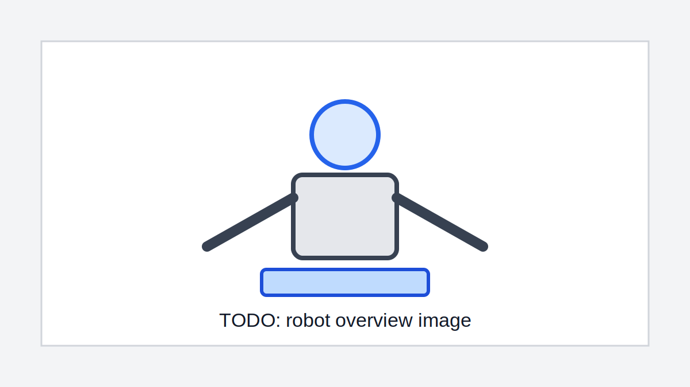

## Table of Contents

1. [Brief Words About Me](#brief-words-about-me)
2. [Before Starting](#before-starting)
3. [Why Robotics Is Hard](#why-robotics-is-hard)
4. [Pipeline](#pipeline)
5. [Robot Description](#robot-description)
6. [Task Description](#task-description)
7. [CAD Construction](#cad-construction)
8. [Simulation Data Collection](#simulation-data-collection)
9. [MuJoCo Simulation](#mujoco-simulation)
10. [Isaac Simulation](#isaac-simulation)
11. [Train A Policy On Simulated Data](#train-a-policy-on-simulated-data)
12. [MuJoCo Benchmark Policy](#mujoco-benchmark-policy)
13. [Fine Tune A Policy](#fine-tune-a-policy)
14. [Going Further](#going-further)
15. [Conclusion](#conclusion)
16. [My Personal Pipeline Of Humanoid Robots](#my-personal-pipeline-of-humanoid-robots)

## Brief Words About Me

I am a passionate machine learning engineer from Switzerland.

For the past five years I have played with robotics: Arduino, Raspberry Pi, CAD software, CNC systems including 3D printers, servo motors and stepper motors, actuators, radios, GSM modules, and, well, electronics in general.

I applied my machine learning knowledge, training models and policies on GPUs, to make these physical elements move intelligently in the physical world.

And it is so much fun, you will see.

## Before Starting

First, if you are reading this document without robotics knowledge, I strongly recommend having a look at the LeRobot project.

LeRobot is an open source project from Hugging Face that makes it easy to get a 3D printed robot setup and running a machine learning policy.

**TODO:** add a GIF of my own LeRobot robot and PushT policy.

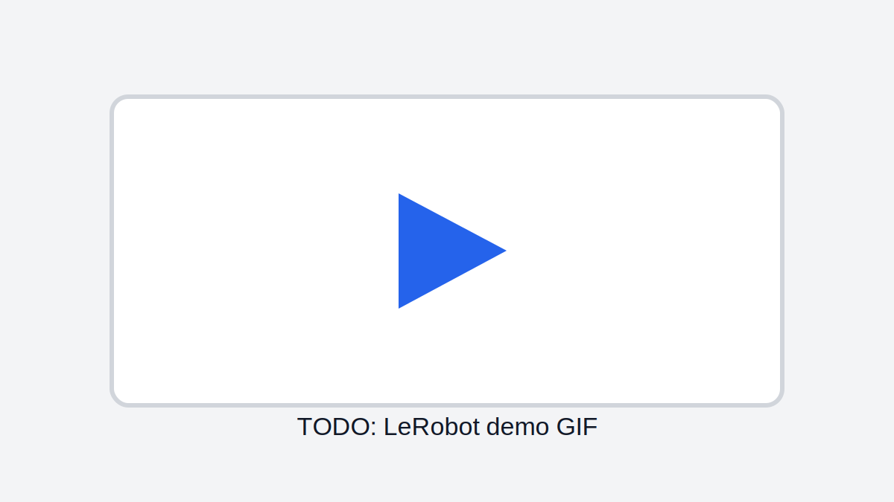

I also encourage you to create your own policy. A good one that I really 
liked is the [DOT policy](https://github.com/IliaLarchenko/dot_policy) from @IliaLarchenko.

If you want to stay completely on your computer, you can also train virtual robots, for example with the PushT policy.

**TODO:** add GIF of my PushT robot.

LeRobot has evolved from a small imitation learning library into one of the most 
complete open-source robotics frameworks. It now contains implementations of 
many SOTA models for imitation learning, reinforcement learning, 
Vision-Language-Action models, world models, and reward models.

We will mention and use some of these models: ACT, Diffusion models, VLA, and 
JEPA.

### Prerequisites For This Project

1. **CAD**: familiarity with CAD software such as Fusion360, FreeCAD or SolidWorks.
2. ***Simulation engines**: MuJoCo from DeepMind, Isaac Sim from Nvidia.
3. **ML knowledge**: imitation learning versus reinforcement learning, ACT, 
   Diffusion models, VLA, JEPA.

Before diving into the project, I suggest getting 
inspired by the future of robotics and by how these technologies may impact our lives.

For this, go have a look at videos of Tesla Optimus, Figure AI, or European companies like Genesis AI, UMEA, 1X or Neural Robotics.

It is very impressive and inspiring.

**TODO:** add video links.

## Why Robotics Is Hard

Before continuing, let me be clear: no, you cannot simply plug Claude Code, Gemini or ChatGPT into humanoid hardware and get a fully autonomous human-looking robot.

LLMs are very good at text, but the physical world is very different from text, and a lot more complex.

To get a sense of it, first note that for LLMs the amount of high quality training data available is incredibly large: the internet, billions of text examples. The space of English text to predict is relatively small: a few thousand common words or tokens.

General purpose robotics is very different.

The inputs are images, camera frames, possibly other sensor data, touch data, 
lidar data for depth, text, or audio commands from a human. Basically any input 
your brain receives from your body.

The output is a set of servo joint coordinates, meaning actions of the robot in the physical world, and potentially voice if the robot is speaking.

Unlike for LLMs, the amount of high quality robotics data, meaning sensor values and ground truth action pairs, is very limited.

Also unlike LLMs, where the prediction space is rather small and discrete, the action space in robotics is continuous, though it can be discretized, and immense.

As a result, even the best LLMs will not perform well if you simply plug them into your robot. It is also going to be very slow.

One needs models capable of understanding the mapping from world observations to actions. These are often called world models.

LLMs with Transformers might not even be the right approach. See interviews and papers from Yann LeCun about world models. He recently created his startup AMI, aiming to produce state of the art world models for real world applications.

To summarize, the two main challenges of robotics today are:

1. We do not have as much data.
2. The models might need to be different.

### Data Challenge

To tackle the first challenge, good quality data, researchers use a mix of simulation and real life imitation learning episodes.

First, you train your robot in a virtual environment that mimics the physics of the real world.

You train your policy or model inside this environment and hope it transfers well to the real world. This is the sim-to-real problem.

Nvidia created Isaac Sim exactly for that: to mimic real world physics very accurately and create realistic simulations, like a super-real video game using Nvidia GPUs.

Then, to fine tune the policy or model trained in simulation, or sometimes to train a policy directly from scratch, one uses imitation learning on actual episodes from the real world.

This can be done with a leader and follower robot, or with a VR headset for example.

These real world episodes record sensor values and action pairs for specific tasks, for example folding laundry.

Recently some startups have paid people in India to record day to day laundry task episodes.

**TODO:** add video or source.

### Model Challenge

The other challenge is the model.

Some people still believe in Transformer-like models to brute force the problem, for example ACT policy or VLA.

Other researchers, like Yann LeCun, believe that current models are not designed to understand the world and the physics ruling the world, and that they do not efficiently create embeddings of the world.

For example, to predict the trajectory of a ball given camera images, a Transformer may look at all details in the image, including the color of the sky or the background, which is very inefficient.

Some of Yann LeCun's models for world modeling are JEPA models.

## Pipeline

The pipeline looks as follows:

1. CAD modeling on Fusion360.
2. 3D print and construct the leader and follower robot.
3. Collect simulation data. We will try both MuJoCo and Isaac Sim to see the pros and cons of each.
4. Train and fine tune policies on simulation data.
5. Collect real world data using the follower and leader.
6. Fine tune the policy obtained from simulation data on real world data.
7. Test and measure the performance of the final policy on the real robot.

For the leader and follower part, we will also try to record episodes using a controller, just to see how well it works.

One could also use a VR headset, but this is too expensive for me for what it might bring.

## Robot Description

The robot is composed of a CNC part and an upper humanoid body part with servo motors.

The CNC part is a CNC machine with stepper motors that I used to play with in previous projects.

The CNC part allows us to place the upper humanoid body part in different work positions.

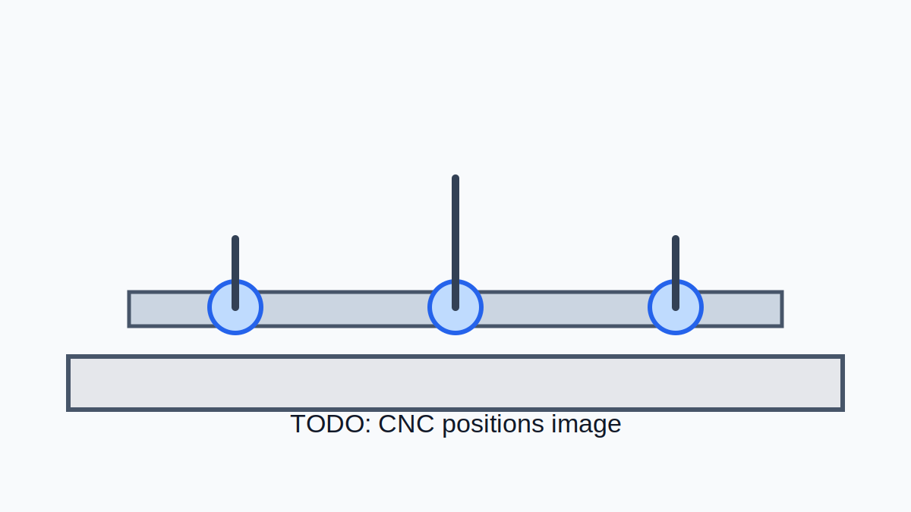

## Task Description

The task resembles a realistic task in a warehouse-like environment, for example a warehouse, a supermarket, a pharmacy, or even a greenhouse or a vineyard.

A robot would navigate in the environment and use its robotic arm to place objects into storage, or remove objects from storage.

For brevity, this report will not discuss autonomous navigation in the warehouse environment, as this does not necessarily require a machine learning model.

But do not take me wrong: in practice, humanoid robots do use policies for navigation as well.

If you are curious, the robot base for navigating the robot looks like this:

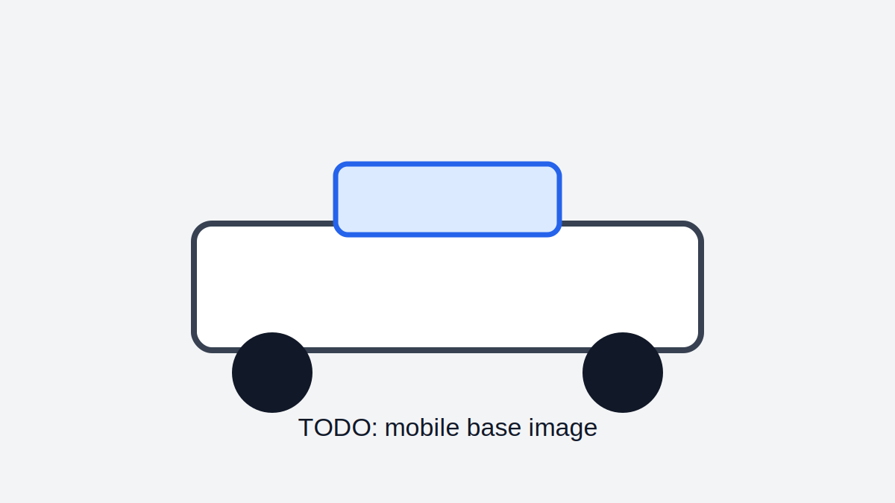

In what follows, we will assume the task happens in a warehouse composed of drawers, with objects to place into or remove from the drawers.

You can generalize this task to many use cases. In a greenhouse, it could mean placing seeds or harvesting a product from a rack. In a supermarket, it could mean placing products on a shelf, but not removing them, since this is done by customers.

For simplicity, I purposely chose not to focus on the upper part of the humanoid robot and not on the legs at the moment. This is an approach also used by Genesis AI.

**TODO:** add video.

All in all, the task description is:

> Given a request to place or remove a product, where we use a foam cube for simplicity, in or from a warehouse, where we use a stack of drawers to mimic warehouse racks, the robot should move its body and arms to perform the user's requested task.

## CAD Construction

Before building anything, we construct a 3D model of the robot.

This is required to validate the design, 3D print the robot, and build the simulation environment in MuJoCo and Isaac Sim.

For this we use Fusion360.

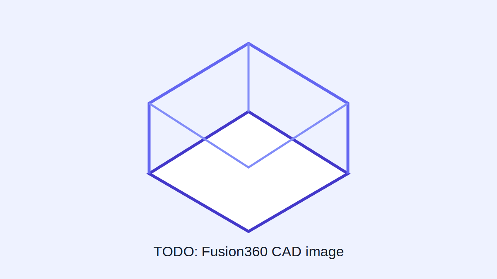

The path to the CAD project is **TODO**.

Each component is modeled as an assembly, possibly made of several sub-components.

**TODO:** add GIF of the CAD.

From this CAD, the robot components were 3D printed and assembled, both for the leader and follower.

Since I do not have a CNC machine for the leader, I will use a controller as explained later.

**TODO:** add GIF of the real robot.

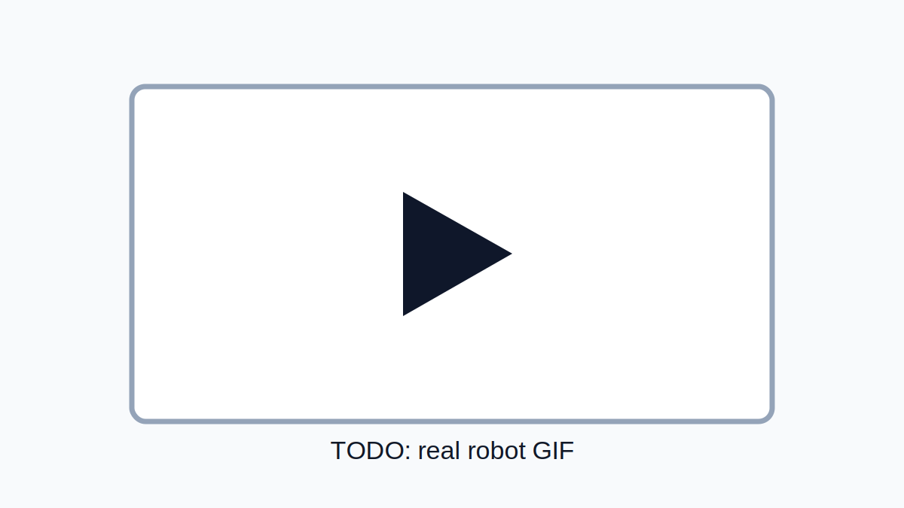

## Simulation Data Collection

It is often dangerous for the hardware, and also time consuming, to directly record real world episodes with the robot.

As mentioned above, the lack of data is one of the two main current challenges in general purpose robotics.

For this reason, and also to validate the hardware, we will build a simulation of the robot that we designed.

We will try both MuJoCo from DeepMind and Isaac Sim from Nvidia to compare the two.

## MuJoCo Simulation

MuJoCo is widely used in research.

It is very easy to install and has a low learning curve.

It is known to be computationally efficient for physics simulation, while still simulating robot dynamics accurately.

You can run it on your local machine, while Isaac Sim requires GPUs.

One important drawback of MuJoCo compared with Isaac Sim is that it does not produce photorealistic rendering. This can be useful when the model requires camera frames, which is the case for humanoid robot models.

### From CAD To Robot Description

To create the MuJoCo simulation, we will use the Fusion360 plugin called ACDC4Robotics to transform a CAD representation into URDF, or even into an MJCF file specific to MuJoCo.

These are robot description files. They contain not only the visual meshes of the components, but also the joint information between robot components, inertia, friction, center of mass, etc.

All of this is required to produce a simulation faithful to reality.

Using ACDC4Robotics requires creating a SIM file project from the CAD project by creating one component per link, and not one component per robot part. Each link must have only one body.

So basically, I first created an empty component for each link, then copied the bodies inside each robot link component, combined the bodies when there were several, to have only one body per robot link component, and finally added the adequate joint, slider or revolute, between each robot link.

In MuJoCo I obtain:

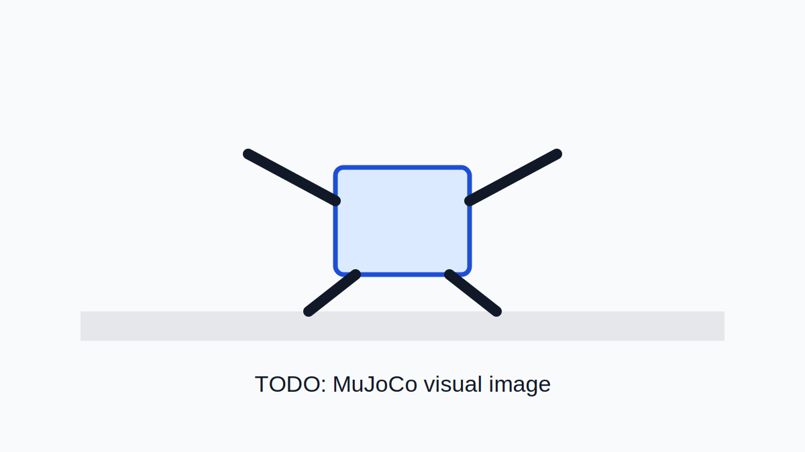

### Collision Geometries

However, by doing this only, we only get a robot with visual mesh geometries and controllable joints.

To obtain a physically realistic robot, we also need to activate physical collisions.

In MuJoCo, the collision engine does not use the visual meshes for collision. Visual meshes are only here for visualization.

Instead, the simulation engine uses coarser and simpler geometries than the visuals to accelerate collision computation.

These coarser geometries need to be made from MuJoCo primitive geometries, simple analytical shapes used for collision detection and physics.

They are much faster and more numerically stable than arbitrary triangle meshes.

Examples are boxes, spheres and cylinders.

So for each link in my updated Fusion360 SIM project, we had to create a coarse STEP file made of primitive geometries. We decided to use only boxes.

We designed a simple Python code to transform a STEP file made of simple Fusion360 extrusions into an MJCF description of primitive box geometries.

**TODO:** add path of the collision STEP files.

**TODO:** add GIF with robot visualization only.

**TODO:** add GIF with collision geometries.

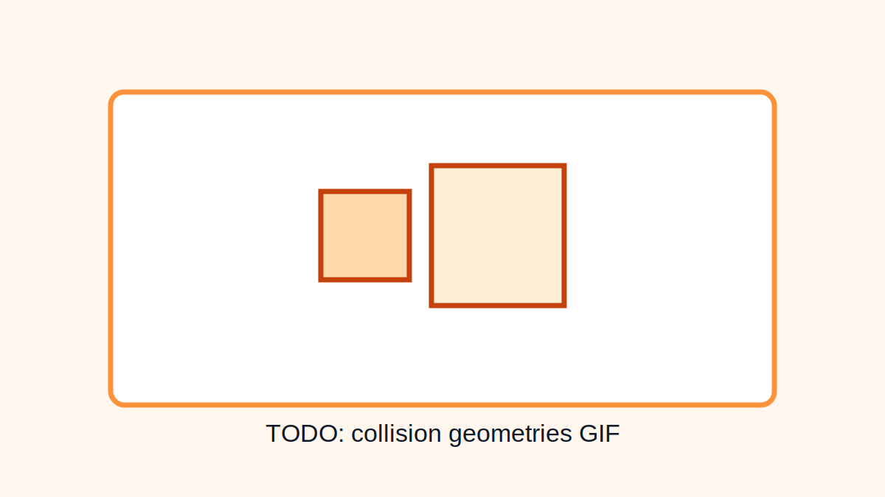

We also made sure to have realistic center of mass and inertia in our final MJCF robot description file.

Now that we have a somewhat realistic digital twin of our robot, let's set things up to record virtual episodes of the robot doing the task described above.

### Recording Episodes In Simulation

Three methods can be used to record episodes in the simulated environment in order to train a first simple benchmark policy for the task:

1. Use a controller.
2. Use a physical leader.
3. Use inverse kinematics, IK.

IK allows you to compute the joint movements required to place the end effector, the robot hand with the gripper, in a target position.

When used several times, it allows us to artificially create a robot movement.

For example: one IK target to place the gripper over the cube, one IK target to open the drawer, one IK target to place the cube in the open drawer, etc.

With this technique, the overall movement of the robot is not natural or flexible.

For example, if the cube falls out of the hand, the robot will not re-fetch the cube and might even continue its movement without it.

But it allows us to create a very large set of episodes, which can be used to train a base or benchmark policy and then fine tune it later using higher quality data.

Recording using a controller or a physical leader is time consuming, so we decided to use IK first to train a benchmark policy.

We will use the physical leader and controller later to fine tune the policy.

Starting from a strong benchmark policy is especially important for RL because it dramatically reduces exploration. It allows the agent to refine an already competent behavior instead of wasting time discovering basic skills from scratch.

Episodes obtained from IK look like this:

We randomize the position and orientation of the cube and the colors of the geometries for better generalization.

For the same reason, we also add a bit of random noise to the position and orientation of the camera between episodes.

**TODO:** add GIF of episodes.

Episodes are stored as a Hugging Face dataset using LeRobot's dataset format, also used by Nvidia and many robotics companies.

## Isaac Simulation

Same as MuJoCo.

**TODO:** complete this section later.

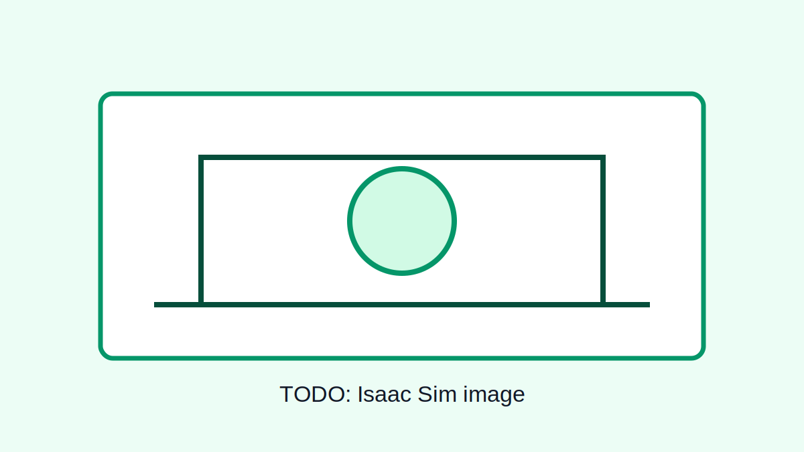

## Train A Policy On Simulated Data

In this section we will use the simulated data from MuJoCo and Isaac to train a base Behavior Cloning policy.

Thanks to IK, we were able to produce thousands of episodes while trying to add some randomization to each episode.

Of course, keep in mind that this is not sufficient and is only meant to obtain a benchmark policy.

Imagine something unseen during training happens, for example the cube drops from the hand, or some drawers are randomly opened. Then the policy will likely fail because IK recorded episodes strongly lack natural randomness, which is sometimes hard to imagine beforehand.

Behavior cloning is a specific imitation learning method that learns a direct mapping from observations to actions using supervised learning.

Imitation learning is the broader field of learning behaviors from demonstrations, including behavior cloning and more advanced methods such as inverse reinforcement learning, DAGGER, and diffusion-based policies.

We will explore several Behavior Cloning methods, from standard models to foundation models.

We summarize each model in one sentence and invite the reader to ask its favorite AI model to learn more about these models:

- **ACT, Action Chunking Transformer:** predicts a sequence of future actions at once using a Transformer, producing smoother and more stable robot trajectories than single-action prediction.
- **Diffusion Policy:** generates robot actions through an iterative denoising process, allowing it to model multiple valid behaviors and produce robust, high-quality motions.

We also explore more complex models to open the work.

For example, VLA does not only take camera frames and robot joints as input, but also text describing the user task request, like "place the red cube in the upper left drawer":

- **Vision-Language-Action models:** learn a policy conditioned on visual observations, robot state, and natural language instructions, enabling a single model to perform many different tasks.
- **VLA-JEPA, World Models:** learn predictive latent representations of future world states, allowing the robot to reason about the consequences of its actions rather than directly imitating demonstrations.

By exploring models with fundamentally different learning paradigms, from direct action prediction to generative policies, language-conditioned foundation models, and predictive world models, we aim to develop a broad understanding of modern robot learning approaches and their respective strengths and limitations.

Our dataset is made of 1000 generated episodes, split 90%-10% between train and test.

We trained on **TODO: GPU name, maybe RTX 5000?**

## MuJoCo Benchmark Policy

### ACT

**TODO:** add training command.

**TODO:** add Hugging Face model and dataset link.

**TODO:** add Weights & Biases link.

### Metrics

| Metric | Value |
| --- | --- |
| Success Rate (%) | TODO |
| Action Error (L1 / MSE / MAE) | TODO |
| Collision Rate | TODO |
| Inference Speed (Hz or ms/action) | TODO |
| Number of Demonstrations | TODO |

### Qualitative Results

**TODO:** add test ground truth GIF.

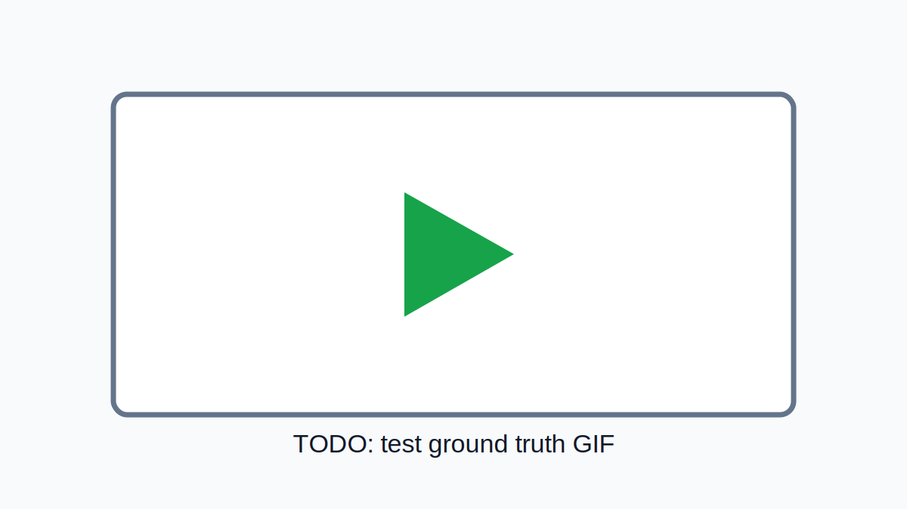

**TODO:** add test predicted GIF.

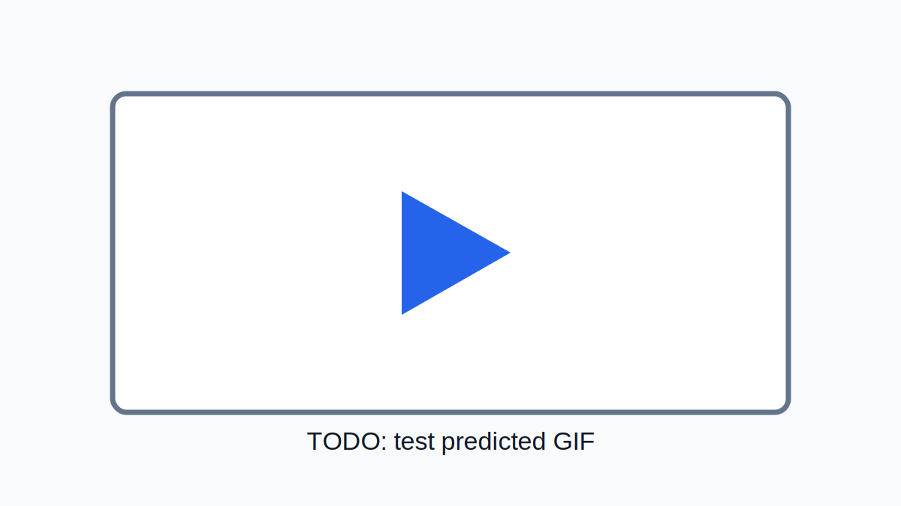

## Fine Tune A Policy

### PPO, Proximal Policy Optimization

**TODO:** complete this section later.

Notes:

- Update repo to normal.
- Ask to add model to W&B and save model to Hugging Face.
- Ask for the command for training ACT.

## Going Further

Maybe for a next video: the project Hepha for companies with warehouse-type environments.

Combine with chatbot, query builder, and RAG.

## Conclusion

Studying this field also allows us to appreciate the complexity of our brain and body, which is a masterpiece of engineering from nature.

Though no physical law prevents humans from copying it artificially, and this will happen sooner or later.

Industry is progressing fast, but humanoid robots are not in homes yet.

There has been huge progress, but there is still a long way to go.

Your phone video can now become a voxel world.

`depth-anything.cpp` is an open-source repo for local geometry inference.

It runs Depth Anything 3 without a Python stack.

Also talk about latest sensing sensors.

Some words on LLMs and why they are not necessarily the solution for robotics.

Likely there is not only one way to general purpose robotics: better simulations, better physics engines, more compute, better models, and better hardware.

## My Personal Pipeline Of Humanoid Robots

1. Simulation is required. Imagine a CAD specific to robotics, with an AI able to create any realistic 3D object in the CAD with all physical properties. Create a metaverse world where robots are trained. AI understanding 3D space is fundamental.
2. Models should be very efficient at learning, and inference should be very fast. Big big models are not necessarily good.
3. Very good hardware with many sensors.
4. Fine tune with real world data.
5. Fine tune with RL in the real world.

## References

This section is still a work in progress.

See [references/README.md](references/README.md).
