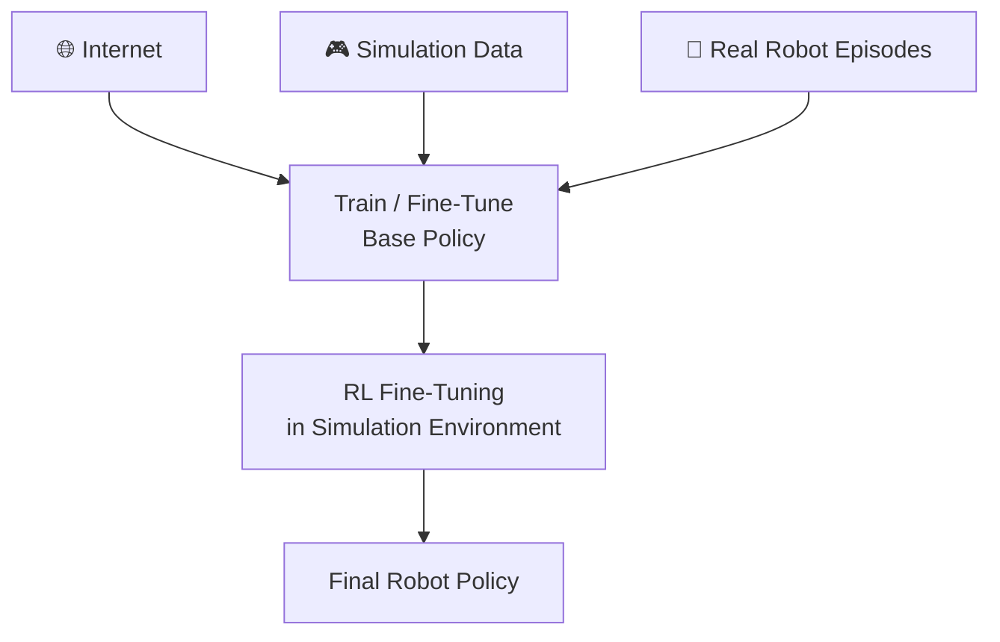
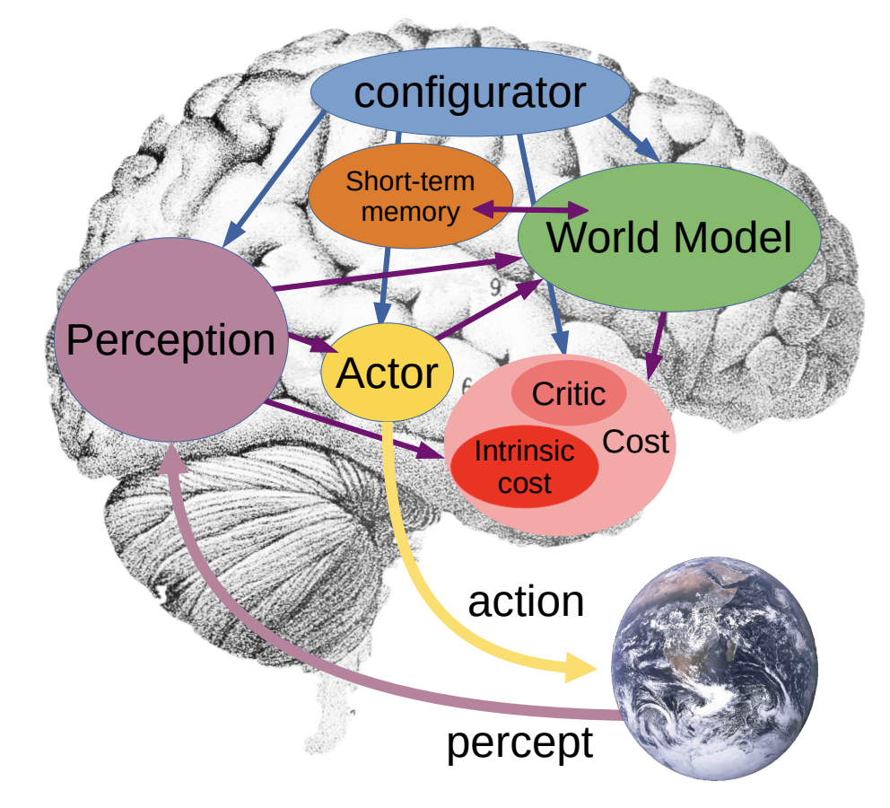
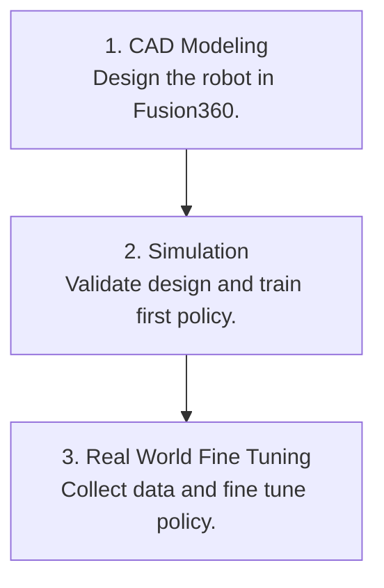

# Hepha

TODO:

- CAD of camera holding and drawers = should finish drawers
- Check ACT policy running a lot faster
- Run flow matching
- Run VLA policy
- Try RL


"I used to fork LeRobot repository but with AI I can easily create a new repo 
with only features of LeRobot that I am interested in"

This document presents *Hepha*, a robotics project where I build and train a 
bimanual robot moving in a warehouse environment.

GIFS of the robot moving in the warehouse

GIFS of the robot moving in the greenhouse

The goals of the project are:

* Become familiar with the technologies and models used in general-purpose
  robotics (such as humanoid robots).
* Explore the challenges and current research directions in general-purpose
  robotics.
* Serve as a tutorial for readers interested in building their own robots. I
deliberately document my trials and errors to help readers understand the
challenges involved and develop an intuition for each SOTA model.

The robot consists of two parts: (1) an upper body composed of a bimanual
robot mounted on a CNC gantry system, and (2) a mobile base, similar to an
Autonomous Mobile Robot (AMR), that enables the robot to navigate throughout
the warehouse environment.

GIFS of the real upper body

GIFS of the mobile base

Most of this document focuses on the robot's upper body, covering the complete
development pipeline: mechanical design in Fusion360, 3D printing, simulation in 
Mujoco and Isaac Sim, demonstration recording for Behavioral Cloning (BC), 
policy training, RL fine-tuning, and closed-loop validation.

I also briefly discuss the robot's autonomous navigation in the warehouse,
coordination between multiple robots, and their integration into a broader
enterprise architecture. In this architecture, the robots, the ERP system, and
the Retrieval-Augmented Generation (RAG) pipeline are connected to a central
coordinator, allowing operators to control an entire fleet of robots from a
single chat interface while continuously updating the ERP and RAG according to 
the robots' actions.

For the robot's upper body, the task is the following:

> *Given a user's request, place or remove a foam cube in the correct warehouse
> drawer.*
>
> **Examples**
>
> - *Place the blue cube from the storage bin into drawer 5.*
> - *Remove the red cube from drawer 2.*
 
The task deliberately captures many of the challenges found in real-world
warehouse environments. Retrieving or placing a foam cube in a drawer
resembles storing or picking products while updating an ERP system. The same
perception, planning, and manipulation pipeline also applies to retail
(stocking supermarket shelves) and agriculture (harvesting crops in a
greenhouse). Although simplified, the techniques explored in this project
generalize to a wide range of robotic applications.

Finally, I share my perspective on the field based on my experience, discussing
the research directions I find the most promising and the challenges that still
remain.

This document was polished using AI, but I have intentionally kept
the writing simple and close to my own words.

This is not a research or survey paper, so please forgive the lack of
formalities. It is a practical project report about what I love doing.

**PS:** I made a summary video of the project here:
**TODO: Link to video**

**PS:** The project is called *Hepha*, after **Hephaestus**, the Greek god of
craftsmanship, invention, and technology.

## Table of Contents

1. [Brief Words About Me](#brief-words-about-me)
2. [Before Starting](#before-starting)
3. [Why General Purpose Robotics Is Hard](#why-general-purpose-robotics-is-hard)
4. [Pipeline Overview](#pipeline-overview)
5. [Step 1: CAD Modeling](#step-1-cad-modeling)
6. [Step 2: Simulation And Benchmark
   Policy](#step-2-simulation-and-benchmark-policy)
7. [Step 3: Real World Fine Tuning](#step-3-real-world-fine-tuning)
8. [Conclusion](#conclusion)
9. [Going Further](#going-further)
10. [Perspective](#perspective)
11. [References](#references)
12. [Citation](#citation)

## Brief Words About Me

I am a passionate machine learning engineer from Switzerland.

For the past five years I have played with robotics: Arduino, Raspberry Pi, CAD
software, CNC systems including 3D printers, servo motors and stepper motors,
actuators, radios, GSM modules, ... and many more.

I then used my machine learning background to train my own policies on the cloud and
make hardware move intelligently.

And it is so much fun, you will see.

## Before Starting

If you don't have experience in robotics yet, I recommend you to have a look at
the LeRobot project.

[LeRobot](https://huggingface.co/lerobot) is an open source project from Hugging 
Face that helps you build a 3D printed robot and run a machine learning policy on it.

**TODO:** add a GIF of my own LeRobot robot.

I also encourage you to create your own policies in LeRobot. A custom policy
that I really liked is the [DOT
policy](https://github.com/IliaLarchenko/dot_policy) from Ilia Larchenko. 

If you want to stay on your computer, without a 3D printed robot, you can also
train policies in virtual tasks, for example the PushT task trained in a Gym
environment.

**TODO:** add GIF of my PushT policy demo.

LeRobot is an amazing open source project. It has evolved from a small 
imitation learning library into one of the most complete open-source robotics 
frameworks. It contains implementations of most of the leading model 
architectures in imitation learning and reinforcement learning, ranging from ACT and 
Diffusion Policy to recent open-source Vision-Language-Action (VLA) and JEPA (Joint 
Embedding Predictive Architecture) family models.

I will mention and use some of these models: ACT, Diffusion models, VLAs, 
and V-JEPA 2. I will reuse LeRobot's dataset schema and some of its model
architectures. However, for learning purposes, I will not use the
low-code approach provided by LeRobot and instead build the models myself. 
I believe that building things yourself is one of the best ways to develop intuition 
and truly understand how things work.

### Prerequisites For This Project

1. **CAD**: familiarity with CAD software such as Fusion360, FreeCAD or
   SolidWorks.
2. **Simulation engines**: MuJoCo from DeepMind, Isaac Sim from Nvidia.
3. **ML knowledge**: imitation learning (particularly behavior cloning)
   and reinforcement learning.

## Why General Purpose Robotics Is Hard

Let me be clear: no, you cannot simply plug Claude Code, Gemini or ChatGPT into
humanoid hardware and get a fully autonomous human-looking robot.

LLMs are very good at text, but the physical world is very different from text,
and a lot more complex.

To get a sense of it, first note that for LLMs the amount of high quality
training data available is incredibly large: the internet, billions of text
examples. The space of English text to predict is relatively small: a few
thousand common words or tokens.

General purpose robotics is very different.

The inputs are images, which are much more complex to analyze than text. Possibly 
other sensor data: touch data, lidar data for depth, text, or audio
commands from a human. Basically, any input your brain receives from your body.

The output is a set of servo joint coordinates, meaning actions of the robot in
the physical world, and potentially voice if the robot should speak.

Unlike for LLMs, the amount of high quality robotics data, meaning observation data
and ground truth action pairs, is very limited.

Also unlike LLMs, where the prediction space is rather small and discrete, the
action space in robotics is continuous, and immense.

As a result, even the best LLMs will not perform well if you simply plug them
into your robot. It is also going to be very slow.

Actually, the autoregressive prediction objective that made LLMs so successful may 
not be the best way to learn representations of the physical world. Predicting every 
pixel of a future image (or reconstructing an entire image, as in an autoencoder) is 
an extremely difficult task, and much of that visual detail is irrelevant for 
decision making. 

Instead we need models capable of understanding the mapping from world 
observations to actions, and vis-versa. Models capable of learning a coherent 
embedding of the world - called *world models*. Recent work in this direction 
includes Yann LeCun's JEPA model architecture family. The idea is to predict a 
high-level representation (embedding) of missing or future information rather than 
the pixels themselves. A typical JEPA consists of:

- **Context encoder** $f_\theta$: encodes the observed part of the input.
- **Target encoder** $g_\xi$: encodes the target (for example, a future frame, a masked region, or another view).
- **Predictor** $h_\phi$: predicts the target embedding from the context embedding.

Rather than minimizing pixel reconstruction error, the model is trained so that

$$
h_\phi(f_\theta(x_{\text{context}})) \approx g_\xi(x_{\text{target}})
$$

This objective encourages the model to capture the semantic information needed to 
understand and predict the world, instead of spending capacity on reconstructing 
fine-grained visual details. LeCun recently founded [AMI Labs](https://amilabs.xyz/), 
a startup focused exactly on developing these next-generation world models.

To summarize, two important challenges of general purpose robotics are:

1. **Data**: high quality ground truth observation-action pairs.
2. **Adequate models**: models capable of understanding the world and the
surrounding physics, while still being very fast at inference. They should 
support inference at roughly 30–50 Hz, meaning the policy produces a 
new action every 20–33 ms. This is fast enough for smooth manipulation and 
good responsiveness. Slower models reduce the robot's ability to react quickly to 
changes in the environment.

### The Data Challenge

Data primarily comes from three sources:

- **Internet data** (text, images, and videos): used to train large foundation 
models on billions of examples. These models learn general-purpose representations 
of the world, although they are not optimized for a specific robot task. Their 
representations can later be adapted to robotics through models such as SmolVLA, or 
by generating synthetic robot data with systems such 
as [FLUX.3 + Mimic](https://bfl.ai/blog/flux-3-mimic).


- **Simulation data**: generated in physics simulators or even video games (FPV 
video games can be used to train humanoid robots). Simulation allows millions of 
episodes to be generated safely, quickly, and at low cost. The challenge is 
the *sim-to-real gap*: no simulator perfectly reproduces the real world. Differences 
often prevent a policy trained purely in simulation from working on a real robot. 
NVIDIA developed (Isaac Sim)[https://developer.nvidia.com/isaac] specifically 
to narrow this gap by providing highly realistic, GPU-accelerated simulations.
(MuJoCo)[https://mujoco.org] (developed by Deep Mind) serves a 
similar purpose and is widely used in robotics research. While less visually 
realistic than Isaac Sim, it is computationally much more efficient and can even run 
on CPUs, making it ideal for rapid experimentation.


- **Real robot episodes**: demonstrations collected by *teleoperating* a robot. 
During teleoperation, the robot records a sequence of observations together with the 
ground-truth actions performed by the human operator. These observation-action pairs 
form the demonstrations used for imitation learning. One common setup is a 
*leader–follower* system: the human moves a leader robot, while the follower 
robot mirrors its movements and records the data. Human can control the robot with 
game controller, a SpaceMouse, VR headsets, motion-capture gloves (e.g. [Mimic 
  Robotics](https://www.mimicrobotics.com/)), or leader–follower robot 
arms. Full-body teleoperation suits are even being developed to 
control an entire humanoid robot. Real robot demonstrations provide the 
highest-quality supervision because they capture the true dynamics, sensor noise, 
and physical interactions of the target robot. However, collecting them is slow, 
expensive, and difficult to scale to millions of episodes.


```mermaid
flowchart TD

%% =========================
%% Data Sources
%% =========================
A1["🌐 Internet"]
A2["🎮 Simulation Data"]
A3["🤖 Real Robot Episodes"]

%% =========================
%% Base Policy
%% =========================
B["Train / Fine-Tune<br/>Base Policy"]

%% =========================
%% RL Fine-Tuning
%% =========================
C["RL Fine-Tuning<br/>in Simulation Environment"]

%% =========================
%% Final Policy
%% =========================
D["Final Robot Policy"]

A1 --> B
A2 --> B
A3 --> B

B --> C
C --> D
```

All three sources of data are generally used together to build a strong base 
policy.

Once the base policy is trained, Isaac Sim and Mujoco provide an environment 
for RL fine-tuning. The robot can practice millions of additional interactions 
while optimizing task-specific reward functions. Examples of rewarded actions: 
successfully grasping an object, avoiding collisions, minimizing energy consumption, 
maintaining balance (for humanoids), etc.

### The Model Challenge

The research community is still divided on what the best approach for learning
world models will be.

Some believe that scaling data, model size, and compute will solve the problem. 
Of course this is the narrative of some big companies like NVIDIA, for obvious 
business reasons.

Others, including Yann LeCun, argue that simply scaling data and compute may
not be sufficient. Instead, they advocate architectures inspired by some
aspects of human cognition. Before performing an action, humans typically
reason and plan using an internal representation of the world built through
years of experience. We can mentally simulate the consequences of different
actions without physically executing them. Once a plan has been chosen,
lower-level motor control—what we often call *muscle memory*—executes it
rapidly and with little conscious reasoning.

This suggests that different levels of intelligence require different
computational mechanisms. High-level decision making involves reasoning,
planning, and predicting future outcomes, while low-level control is more
mechanical, closer to reflexes, and must operate at very high frequency.

For readers interested in this perspective, I highly recommend Yann LeCun's
lecture *A Path Towards Autonomous Machine Intelligence*. In particular,
Figure 1 provides an excellent illustration of this hierarchical view of
intelligence and world models.

There is unlikely to be a single path toward efficient world
models. Better architectures, larger and higher-quality datasets, and
increased compute will probably all contribute. The most successful systems
will likely combine advances in each of these areas.

In this project I experimented with a diverse set of methods to build my own 
opinion and understanding.



**Figure 1:** High-level architecture proposed by Yann LeCun as a foundation for
the JEPA family of world-model architectures. The perception module estimates
the current world state, the world model predicts future states under candidate
actions, the critic evaluates their expected cost, and the actor selects the
best action sequence. Short-term memory stores intermediate states, while the
configurator coordinates all modules for the current task.

## Project Pipeline

The project focuses primarily on the design and training
of the robot's upper body (the dual-arm manipulator). I will only briefly touch
on the mobile base at the end. The project pipeline is:

1. Design the robot in Fusion360.

2. Obtain a proper robot description file (URDF) from Fusion360 and use it to
   build a simulation environment (a digital twin of the real robot) in MuJoCo
   and Isaac Sim.

3. The fun part: train a base policy using imitation learning.

4. Use RL to fine-tune the base policy in the simulated environment.

Most of the work in this document focuses on step 3. Initially, all policies are
trained in MuJoCo rather than on the real robot. MuJoCo provides an excellent
playground to understand how difficult the problem really is without having to
deal with hardware issues, sensor noise, or broken parts.

Some of the intermediate steps presented here are not necessary to
obtain a working policy. I deliberately include them because they helped me
develop a much better intuition for the problem and for SOTA models.

Important concepts covered during policy training are:

* **The importance of failure recovery.** A good policy is not one that performs
  the next step well, but one that remains reliable after thousands of
  consecutive steps. Robotics is even more autoregressive than LLMs: one bad
  action at the beginning can leave the robot in a completely different state
  from the one it was trained on. Throughout the project I use *closed-loop*
  validation, where the robot executes the entire task using only the policy,
  and the final success rate is measured. Diverse data, robust models, and
  RL fine-tuning all help the policy recover from its own mistakes.


* **The challenge of embodiment.** Embodiment refers to the idea that an
  intelligent agent has a physical body through which it perceives and interacts
  with the world. ChatGPT, for example, has no body. If you connect it to a
  robot, it must learn how to control that body and interact with the
  environment. This is one of the main challenges of robotics foundation models:
  they may have been trained on many different robots, but not on *your* robot.
  Fine-tuning of the foundation model is required for the model to
  "learn" its own embodiment. I intentionally designed a robot with 15 degrees
  of freedom that does not resemble existing robots, making embodiment a relevant 
  challenge.


* **The multimodality problem.** A single observation can correspond
  to many valid actions - e.g. an object can be picked from the left or
  from the right. If the training data contains both strategies, a traditional
  regression model may predict their average—which could be an invalid action. 
  Policies should learn a distribution over possible actions given an observation,
  $p(a \mid o)$, rather than predicting a single deterministic action. Gen AI 
  can be a solution. Target distribution that have different modes.For example a 
  simple MSE would optimize to predict the mean of the data. MAE is lot better 
  than MSE. VQ-BeT avoids this by turning continuous actions into discrete tokens, much
like language models turn text into tokens.Because classification solves the 
  problem = this naturally models multiple valid behaviors.
Unlike ACT, there is no CVAE latent variable.
Unlike Diffusion Policy, there is no denoising process. Diffusion model the whole 
  distribution rather than doing point prediction.
Diffusion: "Learn how to gradually remove noise."
Flow Matching: "Learn the velocity field that transports noise into data."
Robot when predicting chunks can go left then right, left then right, .... Realt 
  Time Action Chunking with Large Models


* **The importance of planning horizon.** Predicting a chunk of future actions
  is more effective than predicting only the next action. A robot must
  understand not only where it should move, but also the intended motion,
  velocity, and trajectory. These are better captured when the model predicts a
  sequence of future actions.
The action distribution in robotics versus LLMs is very different: actions are 
  very correlated, sometimes sequence of actions that are the same, etc. Which 
  might make the model always predict the same action.

* **The importance of inference speed.** A larger model may achieve higher
  accuracy, but it is of little practical use if it cannot run at the required
  control frequency. Large models are well suited for high-level reasoning and
  long-term planning, while smaller models excel at fast, reactive control.
  Combining both often provides the best trade-off.
System 1 and system 2 from Daniel Kahneman. See Gemini Robotics paper from Google 
  or Pi0.5 from Physicall Intelligence or Gr00t model from Nvidia.
Real word manipulation and embodiment data would be great new data for LLMs.

Now the robot reaches a state that was never present in the training dataset.

The policy doesn't know what to do there.

It makes another mistake → gets even further away → makes another mistake.

This is called distribution shift or compounding errors.

Only RL can beat the expert, because it optmizes for it.

### Robot Description (Upper Body)

The robot's upper body has 15 Degrees of Freedom (DoF): three linear axes
(x, y, and z) provided by the CNC gantry, and two 6-DoF robotic arms.

The CNC gantry is equipped with closed-loop servo motors that I reused from 
another personal project. It allows the robot to move its arms between different 
work areas: closer to the collector or closer to the warehouse shelves.

**TODO:** add two images of the robot in two work position

### Task Description (Upper Body)

As mentioned earlier, the task is: 

> *Given a user's request, place or remove a foam cube in the correct warehouse
> drawer.*

The task resembles a realistic robot task in a warehouse-like environment. I call 
*warehouse-like environment* any environment composed of zones where
robots maneuver and zones where products are stored, placed, or picked from.
Examples are traditional warehouses, supermarkets, pharmacies, greenhouses, or
even vineyards.

The robot would navigate in the environment and use its arms to place
objects into storage, or remove objects from storage.

I will not discuss autonomous navigation in the warehouse-like environment, as this 
does not necessarily require a ML model. If you are curious, the real robot base for 
navigation looks like this (it should use omniwheels in some settings or 
mechanical wheels):

**TODO:** add GIFS of the robot base moving

In humanoid robot design, not using legs but an Autonomous Mobile Robot (AMR) is 
an approach also taken by [Genesis AI](https://www.genesis.ai/). It greatly 
simplifies the problem while preserving most of the robot's capabilities.

**TODO:** add GIFS of Genesis AI robot

TODO: mention about the complexity of the task: not always fetch the cube or open 
drawer with the same hand, hand collaboration, moving in the right direction with 
respect to hand 1 or 2, etc.

## Step 1: Model The Robot CAD

First, I construct the 3D model of the robot.

This is required to validate the design, 3D print the robot, and build the
simulation environment in MuJoCo and Isaac Sim.

I use [Fusion360](https://www.autodesk.com/products/fusion-360/overview).

The path to the CAD project is **TODO**.

Each component is modeled as an assembly, possibly made of several
subcomponents:

```text
hepha-robot-cad
├── base
├── cnc_x
├── cnc_y
├── shoulder_l
├── shoulder_r
├── head
├── forearm_l
├── forearm_r
├── arm_l
├── arm_r
├── wrist_l
├── wrist_r
├── hand_l
├── hand_r
├── finger_l
├── finger_r
├── storage_rack
└── storage_bin
```

The structure of the Fusion360 assembly is very important because the
requirements for 3D printing and URDF export are different.

* Rule 1 (3D printing): each physical part should be its own assembly
  (although your assembly can be nested to keep the project organized). It's
  the conventional structure used in CAD projects, as shown above.

* Rule 2 (URDF export): the assembly hierarchy must instead follow the
  robot's kinematic tree: each movable link should be represented by a
  separate assembly. For example, the left shoulder link is one assembly, the
  left upper arm another, and so on, connected by revolute or linear joints.
  I describe this structure in the next section.

Because these two hierarchies serve different purposes and are organized 
differently, I maintain two separate Fusion360 projects.

**TODO:** add GIF of the CAD.

The robot components were 3D printed and assembled, for both the leader and follower.
Since I do not have a CNC machine for the leader, I used a controller to
lead the CNC follower.

**TODO:** add GIF of the real robot with the leader and follower.

## Step 2: Build The Simulation Environment

Tell that you used IK to see if everything works in the environment.

Building a simulation environment with a digital twin of the robot is essential 
to validate the hardware and train RL policies. I will try both MuJoCo and Isaac Sim 
and compare the two.

### From CAD to URDF

To create a robot description file that can be used by simulators, I use the
Fusion360 plugin `ACDC4Robotics` to convert the CAD model into a `.urdf` file.
A `.urdf` file describes the robot: it contains not only the visual meshes of
its components, but also the joints between them, inertial properties, centers
of mass, friction parameters, and other information required to build a
realistic simulation.

To use `ACDC4Robotics`, I had to transform my original
`hepha-robot-cad` project into a new project called `hepha-robot-sim`.
You can find it at **TODO:** add path.

In the CAD project, components are organized as physical robot parts. In the
simulation project, they must instead follow the robot's kinematic tree: one
component per **link**, with exactly one body inside each link component.

```text
hepha-robot-sim
├── cnc_x_link
├── cnc_y_link
├── shoulder_l_link
├── shoulder_r_link
├── forearm_l_link
├── forearm_r_link
├── arm_l_link
├── arm_r_link
├── wrist_l_link
├── wrist_r_link
├── hand_l_link
├── hand_r_link
├── finger_l_link
├── finger_r_link
├── drawer_1_link
├── drawer_2_link
├── drawer_3_link
├── drawer_4_link
├── drawer_5_link
├── drawer_6_link
├── drawer_7_link
├── drawer_8_link
├── drawer_9_link
└── head_link
```

To create this new hierarchy, I first created an empty component for every
link. I then copied the relevant bodies into their corresponding link
components, combined them into a single body using Fusion360's `combine` tool,
and finally created the joints between the links (`revolute` or `slider`).

**TODO**: GIFS of the simulated robot

### MuJoCo

MuJoCo is one of the most widely used physics simulators in robotics research.
It is easy to install, has a relatively low learning curve, and is
computationally efficient while still providing accurate physics simulation.
Unlike Isaac Sim, MuJoCo runs well on a local machine without requiring a GPU.
Its main drawback is that it does not produce photorealistic renderings, which
can be important for vision-based robot policies (like for humanoid robots).

The `.urdf` file generated in the previous section only defines the robot's
visual meshes and joints. Since visual meshes are only used for rendering, I
also needed to define collision geometries to obtain a physically realistic
simulation.

MuJoCo's physics engine relies on simple primitive geometries (boxes, spheres,
cylinders, etc.) for collision detection, as they are much faster and more
numerically stable than arbitrary triangle meshes. For each link in my
`hepha-robot-sim` project, I therefore created a simplified `.step` file made
only of primitive boxes. I then wrote a small Python script to convert these
files into the corresponding MJCF collision geometries.

Finally, I ensured that the robot had realistic joint limits, centers of mass,
and inertia before running the simulation.

**TODO:** add path to the collision `.step` files.

**TODO:** add path to the final `.urdf` file.

**TODO:** add GIF showing the collision geometries.

### Isaac Sim


## Step 3: Base Policy Training

First, define the metrics

- importance of failure recovery: act on simplified data + importance of planning 
  horizon with act
- challenge of embodiment: explain how to fine tune the foundation model + 
  importance of inference speed

ACT simple

Foundation simple

Act random

Diffusion random

Foundation 0 random 

Foundation 1 random

With BC real robot

RL fine tuning 

Final demo

metrics: closed loop validation, achievement: grasped cube, ...


## Step 4: RL Fine Tuning


#### Collision Geometries


#### Recording Episodes In Simulation

Now that I have a somewhat realistic digital twin of the robot, I can set things
up to record virtual episodes of the robot doing the task. Three methods can be
used to record episodes in the simulated environment:

1. use a controller,
2. use a physical leader,
3. use inverse kinematics, IK.

IK allows to compute the joint movements required to place the end effector, the
robot hand with the gripper, in a target position. When used several times, it
allows to artificially create a robot movement. For example, I can decompose the
movement "grab the cube and place it into the drawer" into smaller targets:
"place the hand in grab position", "close the hand", "move the hand above the
drawer", and "open the hand".

With this technique, the overall movement of the robot is not very natural or
flexible. For example, if the cube falls out of the hand, the robot will not
re-fetch it and will continue the movement without the cube. But IK makes it
possible to create a large set of episodes, which can be used to train a
benchmark policy and fine tune it later with higher quality data.

Recording using a controller or a physical leader is on the other hand time
consuming, so I decided to use IK first to train a benchmark policy. I will use
the physical leader and controller later to fine tune the policy.

Starting from a strong benchmark policy is especially important for RL because
it dramatically reduces exploration. It allows the agent to refine an already
competent behavior instead of wasting time discovering basic skills from
scratch.

**TODO:** add GIF of episodes.

Before the start of each episode, I randomize the position and orientation of
the cube, the colors of the geometries, and add a bit of noise to the camera
position and orientation between episodes for better generalization.

Episodes are stored as a Hugging Face dataset using LeRobot's dataset format,
also used by Nvidia and many robotics companies.


#### Training The Policy

In this section I will use the simulated data from MuJoCo to train a base
Behavior Cloning (BC) policy.

Thanks to IK, I was able to produce thousands of episodes while trying to add
some randomization to each episode. IK is not sufficient to build a strong
policy and is only meant to obtain a benchmark policy. Imagine something unseen
during training happens, for example the cube drops from the hand, or some
drawers are randomly opened. Then the policy will likely fail because IK
recorded episodes strongly lack natural randomness.

BC is a specific Imitation Learning (IL) method that learns a direct mapping
from observations to actions using supervised learning. IL is the broader field
of learning behaviors from demonstrations, including BC and more advanced
methods such as inverse reinforcement learning and DAgger (Dataset Aggregation).

I will explore several BC methods, from standard models to foundation models. I
summarize each model in one sentence and invite the reader to ask its favorite
AI model to learn more:

- **ACT, Action Chunking Transformer:** predicts a sequence of future actions at
  once using a Transformer, producing
smoother and more stable robot trajectories than single-action prediction.
- **Diffusion Policy:** generates robot actions through an iterative denoising
  process, allowing it to model multiple
valid behaviors and produce robust, high-quality motions.

I will also explore more complex models to open the work.

- **Vision-Language-Action models:** learn a policy conditioned on visual
observations, robot state, and natural language instructions, enabling a single
model to perform many different tasks. In this project, VLA takes as input the
task request prompted by the user like "place the red cube in the upper left
drawer" or "remove the cube from the lower right corner".

- **VLA-JEPA, World Models:** learn predictive latent representations of future
  world states, allowing the robot to
reason about possible action consequences in latent space before acting, instead
of only imitating demonstrations directly.

By exploring models with fundamentally different learning paradigms, I aim to
give you (and myself) a broader understanding of modern robot learning
approaches, with their respective strengths and limitations.

My dataset is made of 1000 generated episodes of around 60 seconds each, split
90%-10% between train and test.

The policies were trained for up to 100 epochs with early stopping, on an NVIDIA
RTX 5090 GPU with 32 GB VRAM, 60 GB RAM, and 15 vCPUs.

##### ACT

# TODO: add paper summary at the beginning

ACT addresses a related problem from a different angle.

Instead of:

observation → next action

ACT predicts a chunk of future actions:

observation_t ↓ Transformer ↓ [a_t, a_t+1, a_t+2, ... a_t+k]

Why?

Because predicting individual actions at high frequency makes errors accumulate
and can produce jittery behavior.

###### Training

**TODO** add some weight and bias plots to show how many steps + how ofter
validation and checkpoints are saved.

**TODO:** add training command.

**TODO:** add Hugging Face model and dataset link.

**TODO:** add Weights & Biases link.

###### Metrics

| Metric | Value |
| --- | --- |
| Success Rate (%) | TODO |
| Action Error (L1 / MSE / MAE) | TODO |
| Collision Rate | TODO |
| Inference Speed (Hz or ms/action) | TODO |
| Number of Demonstrations | TODO |

###### Qualitative Results

**TODO:** add test ground truth GIF.

**TODO:** add test predicted GIF.

##### Diffusion Policy

But robot behavior is often multimodal.

Imagine grabbing a cup. You could approach it:

← from left

or

from right →

A regression model trained with MSE can effectively average different valid
demonstrations, potentially producing an action that corresponds to neither
strategy. Diffusion Policy instead learns a distribution over action sequences:

###### Training

**TODO:** add training command.

**TODO:** add Hugging Face model and dataset link.

**TODO:** add Weights & Biases link.

###### Metrics

| Metric | Value |
| --- | --- |
| Success Rate (%) | TODO |
| Action Error (L1 / MSE / MAE) | TODO |
| Collision Rate | TODO |
| Inference Speed (Hz or ms/action) | TODO |
| Number of Demonstrations | TODO |

###### Qualitative Results

**TODO:** add test ground truth GIF.

**TODO:** add test predicted GIF.

##### Vision-Language-Action (VLA)

###### Training

**TODO:** add training command.

**TODO:** add Hugging Face model and dataset link.

**TODO:** add Weights & Biases link.

###### Metrics

| Metric | Value |
| --- | --- |
| Success Rate (%) | TODO |
| Action Error (L1 / MSE / MAE) | TODO |
| Collision Rate | TODO |
| Inference Speed (Hz or ms/action) | TODO |
| Number of Demonstrations | TODO |

###### Qualitative Results

**TODO:** add test ground truth GIF.

**TODO:** add test predicted GIF.

##### VLA-JEPA

###### Training

**TODO:** add training command.

**TODO:** add Hugging Face model and dataset link.

**TODO:** add Weights & Biases link.

###### Metrics

| Metric | Value |
| --- | --- |
| Success Rate (%) | TODO |
| Action Error (L1 / MSE / MAE) | TODO |
| Collision Rate | TODO |
| Inference Speed (Hz or ms/action) | TODO |
| Number of Demonstrations | TODO |

###### Qualitative Results

**TODO:** add test ground truth GIF.

**TODO:** add test predicted GIF.

#### Fine Tune The Policy Using RL

Reinforcement Learning (RL) is a subset of machine learning where a policy
learns by doing actions in an environment and getting rewards from these
actions. In the RL setup, the robot is usually called the agent. It explores the
environment, tries actions, receives rewards, and updates its policy based on
what worked or not. With this setup, it is easy to see why RL is interesting for
robotics: robots also learn by acting in a physical or simulated world.

However, using RL directly in the real world can be dangerous and inefficient.
Imagine asking a humanoid robot to learn walking from scratch with an untrained
policy. It would perform random actions for a long time before mastering the
movement, and the hardware, or even the environment around it, could be damaged.
Another difficulty is reward design. For example, what should the reward for
walking be? "Stay upright and move in all directions" sounds reasonable, but a
robot could achieve this reward in a strange way without really learning a
natural walking behavior.

This is why RL is often more useful for fine tuning in robotics. The robot
should already have a strong benchmark policy, so it can explore safely and only
improve what still needs adjustment. For example, a humanoid robot that already
knows how to walk and avoid collisions could use RL to refine its behavior for a
more specific objective. RL can also help the robot adapt on the fly: if it
encounters new situations and collides with objects, the policy can be fine
tuned to avoid these failures in the future, a bit like humans learn from
experience.

In this project, I use RL after each BC policy is trained. The goal is not to
learn the whole task from scratch, but to update the policy and make the
movements safer and smoother. For example, RL can help prevent self-collisions,
such as the left and right arms colliding with each other.

I will use Proximal Policy Optimization (PPO), which is very commonly used in
robotics. With PPO, I can train the policy by simulating many robots in
parallel, all collecting experience and updating the same policy. So in MuJoCo,
I simulate **TODO: number of robots** robots in parallel. Each robot, or agent,
starts from the benchmark policy, and the policy is then fine tuned through PPO.
The simulations are run on **TODO: GPU specs, same as before**.

**TODO:** describe some mock specs and results.

**TODO:** add GIF of all robots in MuJoCo simulation.

#### Conclusion On Mujoco's Benchmark Policy

### Isaac Sim - Isaac Lab

#### Recording The Episodes In Isaac Sim

#### Training The Policy

##### ACT

###### Training

**TODO:** add training command.

**TODO:** add Hugging Face model and dataset link.

**TODO:** add Weights & Biases link.

###### Metrics

| Metric | Value |
| --- | --- |
| Success Rate (%) | TODO |
| Action Error (L1 / MSE / MAE) | TODO |
| Collision Rate | TODO |
| Inference Speed (Hz or ms/action) | TODO |
| Number of Demonstrations | TODO |

###### Qualitative Results

**TODO:** add test ground truth GIF.

**TODO:** add test predicted GIF.

##### Diffusion Policy

###### Training

**TODO:** add training command.

**TODO:** add Hugging Face model and dataset link.

**TODO:** add Weights & Biases link.

###### Metrics

| Metric | Value |
| --- | --- |
| Success Rate (%) | TODO |
| Action Error (L1 / MSE / MAE) | TODO |
| Collision Rate | TODO |
| Inference Speed (Hz or ms/action) | TODO |
| Number of Demonstrations | TODO |

###### Qualitative Results

**TODO:** add test ground truth GIF.

**TODO:** add test predicted GIF.

##### Vision-Language-Action (VLA)

###### Training

**TODO:** add training command.

**TODO:** add Hugging Face model and dataset link.

**TODO:** add Weights & Biases link.

###### Metrics

| Metric | Value |
| --- | --- |
| Success Rate (%) | TODO |
| Action Error (L1 / MSE / MAE) | TODO |
| Collision Rate | TODO |
| Inference Speed (Hz or ms/action) | TODO |
| Number of Demonstrations | TODO |

###### Qualitative Results

**TODO:** add test ground truth GIF.

**TODO:** add test predicted GIF.

##### VLA-JEPA

###### Training

**TODO:** add training command.

**TODO:** add Hugging Face model and dataset link.

**TODO:** add Weights & Biases link.

###### Metrics

| Metric | Value |
| --- | --- |
| Success Rate (%) | TODO |
| Action Error (L1 / MSE / MAE) | TODO |
| Collision Rate | TODO |
| Inference Speed (Hz or ms/action) | TODO |
| Number of Demonstrations | TODO |

###### Qualitative Results

**TODO:** add test ground truth GIF.

**TODO:** add test predicted GIF.

#### Fine Tune The Policy Using RL

#### Conclusion On Isaac Sim & Lab Benchmark Policy

## Step 3: Real World Fine Tuning

#### Recording Real World Episodes

#### Fine Tune The Policy

Use real world episodes + RL

## Conclusion

One advantage of simulation = smaller model

## Going Further

Maybe for a next video: the project Hepha for companies with warehouse-type
environments.

Combine with chatbot, query builder, and RAG.

## Perspective

I think this is a very special moment for AI and robotics. During the last few
years, researchers managed to train smart models on text, images, and audio.
This is remarkable, especially because these models never learned directly from
the physical world. They learned about water and fire from internet data, but
they never drank a cup of water, jumped into a lake, or burned themselves.
Humans learn a large part of intelligence from these experiences. If a person
only learned life from textbooks, without ever touching, moving, falling,
carrying, or feeling anything, I doubt this person would develop the same
intelligence as everyone else.

If models could interact with the physical world, the learning signal would
become much richer. A brain without a body is limited. The body gives the brain
an enormous amount of data every second: vision, hearing, touch, smell, taste,
temperature, proprioception, balance, pain, interoception, etc. Current AI
models can show impressive intelligence while still failing at basic physical
tasks. This is not surprising: models have had more access to quantum physics
books than to data about how to drink a cup of water.

The race to give AI a body has started. Hardware has become more complex, and
robots are becoming more capable. This is visible in videos from Figure AI,
Genesis AI, or Tesla Optimus. At the same time, society needs to prepare
carefully. Jobs will change. The quantity of compute required to train and run
these systems is staggering, so the environmental impact also matters. The
prospects are very interesting, but also worrying if misused.

Still, it is important not to get ahead of ourselves. As explained in this
report, the complexity of the physical world is nowhere close to the complexity
of well formatted and bounded text data, or even image and audio data. Industry
is progressing fast, but humanoid robots are not in homes yet. The models and
setups are still very specific to each task. It is already much better than the
old "if this, then that" robotics logic, but it is still not one model fits all
like with LLMs.

My view is that the biggest issue is data. With good quality data, research in
model architecture becomes easier and will follow more naturally. One solution
is simulation: scan the world, recreate every object digitally in 3D using AI,
and give each object realistic physical properties. Highly realistic simulation
would allow training benchmark policies for humanoid robots before safely
rolling them out in the physical world.

Then, as done in this report, a basic benchmark policy trained on simulated data
can be used to roll out a humanoid robot more safely in the physical world. The
first humanoid robots people see will probably not be very smart, or even very
useful. But they will collect crucial real world data to make the next
generation of robots smarter, similar to what Tesla cars do today for autonomous
driving. This can become a positive loop: the more people buy robots, the
smarter the robots become; and the smarter the robots become, the more people
buy them. VAM are a good way to also learn a world model. The exact BERT
architecture matters less today than the paradigm it helped establish:

large-scale pretraining → general representation → downstream adaptation
Transferring this philosophy to physical embodiment—through
Vision-Language-Action (VLA) models like RT-2, PaLM-E, OpenVLA, and
VoxPoser—unlocks physical zero-shot and few-shot behaviors: This helped
establish the modern foundation-model / scaling paradigm:

Train one enormous general model → prompt it to perform many different tasks.

That philosophy is increasingly being transferred to robotics.

RT-2: Vision-Language-Action Models Transfer Web Knowledge to Robotic Control:
This paper helped establish what we now call Vision-Language-Action (VLA)
models. It demonstrated that knowledge learned from Internet-scale
vision/language data could improve robotic generalization and semantic
reasoning.

An entirely new industry will likely rise around this. Compute will need to
become more efficient, maybe with quantum computing one day. Hardware will
become more precise. Models will become smarter and better adapted to
understanding the physical world and mapping observations to actions. Real-world
deployment sets a hard constraint: the model has to act as fast as the world
moves.

These new models will not only be useful for humanoid robots. If they can
understand the physical world better than current models, they could become
useful for many other applications too: autonomous cars, aircraft, physics
research, chemistry, and probably many fields I cannot even imagine yet. They
may even go beyond human intuition in some cases. For example, if you throw a
ball in the air, a strong world model could predict not only where it will land,
but also its speed, its temperature change, and many other physical details that
humans do not naturally estimate.

There is a need to large scale open source datasets for robot for large
pretraining robot foundation-model idea. RT-X models are robot foundation models
trained on data from many different robots, tasks, and institutions, rather than
one model trained only on one robot.

This is strategically important because robotics has a data problem. There is no
robotics equivalent of the entire Internet.

The data story is particularly compelling

This also relates directly to your earlier Street View idea.

You don't necessarily need robot data to learn all parts of the model.

You could pretrain spatial understanding from enormous passive datasets:

multi-view images + video→3D spatial representation

Then learn generic dynamics from video:

Z t 3D ​

→Z t+1 3D ​

Then use the much scarcer robot datasets to learn action-conditioned dynamics:

(Z t 3D ​

,a t ​

)→Z t+1 3D ​

This matters because robot demonstrations are expensive, while images and videos
are essentially unlimited.

BILLIONS OF IMAGES / VIDEOS ↓ learn geometry + objects + semantics ↓ 3D WORLD
MODEL ↓ MILLIONS OF ROBOT TRAJECTORIES ↓ learn action → physical consequence ↓
ACTION-CONDITIONED 3D WORLD MODEL ↓ thousands of demonstrations for your
specific robot ↓ ROBOT POLICY

Yes, absolutely. Video game data—especially footage of real people playing
games—is currently one of the primary sources used to pre-train world models and
foundation models for robotics

DeepMind trained Genie on 200,000+ hours of unlabelled 2D platformer gameplay
videos.

goal = zero-shot generalization Fei-Fei Li’s World Labs

I do not believe in full zero shot learning

world models are heavily accelerating the development of autonomous vehicles
(AVs). Platforms like NVIDIA's Cosmos world foundation model are built
specifically to handle both general robotics and autonomous driving

https://marble.worldlabs.ai/

Studying this field also makes us appreciate the complexity of the human brain
and the body. Both are masterpieces of engineering from nature. No physical law
prevents humans from copying parts of this artificially, and this may happen
sooner or later. Maybe it takes 30 years, maybe 100 years.

## Future Work

## References

This section is still a work in progress.

See [references/README.md](references/README.md).

## Citation


- The trajectory problem
- The importance of failure, so RL
- The autoregressive failure: the importance of closed loop simulation and testing
- The importance of embodiment
- big model and small model
- The challenge of zero shot learning
- The importance of inference speed
- Discuss all metrics that are generally used in robotics to access the goodness
of a policy (closed loop validation)


I purposely made the robot different than traditional robot in order to test
embodiment (make embodiment more challenging).

Because Diffusion Policy learns a score function (gradient field) over the
action space rather than a direct mapping, it is significantly better at
recovering from unexpected physical bumps, obstacles, or displaced objects
mid-task.

Because every robot has a different physical body (kinematics, arm length,
gripper type, joint limits) and camera setup (angles, focal lengths, lighting),
deploying these models zero-shot on an unseen robot is very difficult and
usually fails.  1. Do people actually use them "Zero-Shot"?Rarely in practice.
Zero-shot transfer (placing a model directly onto a totally new robot with zero
extra training) is still an open research challenge.

When people say a model is a "Generalist" or "Zero-Shot," it usually means
zero-shot for new objects, new locations, or new natural language instructions
on a robot body the model has already seen during pretraining.

What works Zero-Shot: Handing the model a new item (e.g., "pick up the purple
dinosaur toy") on a standard arm it was trained on (like a Franka Emika Panda or
Aloha dual-arm).  What breaks Zero-Shot: Putting the model on a different
hardware setup. If your camera is mounted 15 cm lower, or your gripper moves at
a different speed, zero-shot performance drops significantly.

If you have a robot that wasn't in the training set (e.g., a custom UR5, xArm,
or custom 3D-printed arm), you don't use the model zero-shot. Instead, you use
Few-Shot Fine-Tuning. Like what is done between Dark Forest Labs and Mimic!

Neither should be considered truly Hepha-compatible zero-shot until an
embodiment adapter is trained.

hepha_act_100_simple_drawer_5: 82 episodes with 500 tentatives Total 100 episode
for 646 attends

Now that I went through the project overview and the main challenges of general
purpose robotics, let's deep dive into the project:

Video Pre-Training (VLA Models): Pre-train a Vision-Language-Action (VLA) model
or World Action Model (WAM) on internet-scale video datasets (including human
everyday videos and video game play logs). This establishes spatial "common
sense," visual scene understanding, and motion priors.

The safer one is residual RL: final_action = frozen_bc_policy(obs) +
rl_residual(obs) So ACT/Diffusion gives a reasonable behavior prior, and PPO
only learns corrections. Behavioral Cloning (BC) almost always happens BEFORE
Reinforcement Learning (RL).

In standard robotics and simulation pipelines, BC acts as the pre-training
(warm-start) phase, while RL acts as the fine-tuning phase. Residual RL: A
pre-trained BC network outputs a base action, while a smaller RL network runs
concurrently to learn an additive "correction" offset
($\mathbf{a}_{\text{final}} = \mathbf{a}_{\text{BC}} + \mathbf{a}_{\text{RL}}$).

It’s easy to look at recent advances in Vision-Language-Action (VLA) models and
Diffusion Policies and think, "If the AI can observe human demos and clone them
directly, why do we still need physics engines like MuJoCo or Isaac Sim?"

The short answer: A foundation model + BC dataset can teach a robot what to do,
but without a simulation engine, it has no safe place to learn how not to fail.

Pure BC is inherently open-loop imitation. A simulation engine provides the
closed-loop feedback, safety sandbox, and synthetic scaling necessary to turn an
brittle demo mimic into a reliable industrial policy.

In a BC dataset, human teleoperators almost always perform the task
successfully. They rarely show the robot:

What to do if its hand slips off an object halfway through a grasp.

How to recover if its foot slides 2 centimeters on a slick floor.

How to stabilize itself after a sudden external bump.

Because the policy only saw pristine trajectories during BC, a tiny 1% tracking
error in frame 10 shifts the robot into an unfamiliar state. In frame 11, it
makes a bigger error, and by frame 20, it drifts completely off course or
crashes.

Where Simulation Fits In: You put the BC policy inside a physics simulation,
intentionally knock it around with random forces, and let RL teach the robot
error-recovery behaviors across millions of failure cases—without damaging a
$150, 000 real-world robot. + Infinite Data Augmentations (Domain
Randomization). Collecting 500 real-world teleop demonstrations takes weeks of
human effort.

Simulation scales your modest BC dataset into millions of extreme edge-case
variations overnight.

Real-Time Execution Speed (Simulation as a Safety Guardrail) Large foundation
models are computationally heavy. Running an 8-Billion parameter VLA model
directly in an end-to-end control loop on onboard edge compute often yields low
update rates (e.g., 5 Hz to 10 Hz).

A humanoid balancing or manipulating delicate objects requires high-frequency
control loops (100 Hz to 1,000 Hz).

The SOTA Setup: The Foundation Model / BC policy runs slowly in the background,
outputting high-level spatial targets at 5 Hz.

The Sim-Trained RL / Controller: A lightweight policy (trained in simulation)
runs onboard at 500 Hz, consuming those spatial targets and maintaining
instantaneous dynamic balance and torque regulation.

Pretrained Backbone: You download a model like OpenVLA or Octo. It already
understands what a "cup" looks like, what "pick up" means, and basic
physics/spatial awareness from being trained on ~1,000,000 robot trajectories
(e.g., the Open X-Embodiment dataset).  Collect 10 to 50 Teleoperated Demos: You
use a VR controller, leader-follower arm, or space-mouse to teleoperate your
specific robot doing a task 20–50 times while recording camera feeds and your
robot's exact joint angles.Parameter-Efficient Fine-Tuning (LoRA): Instead of
training the entire 7-billion-parameter model from scratch, you freeze the model
and train a small "adapter" (LoRA).  Result: In 15–30 minutes of training on a
single GPU, the model adapts its spatial understanding to your exact camera
placement, lens distortion, and motor response.

Cross-embodiment adaptation is one of the purposes of VLA fine-tuning.

Google Deep Mind Gemini Robotics 2

Genie (Generative Interactive Environments)

PEFT means Parameter-Efficient Fine-Tuning. pipeline uses LoRA, a common PEFT
method

DDPM: discrete probabilistic denoising steps usually predicts noise or clean
samples

Flow matching: learns a continuous velocity field integrates an ODE from noise
to actions

low matching often needs fewer inference iterations. SmolVLA uses this to
generate action chunks efficiently.

Pretrained SmolVLA vision-language understanding temporal action generation
original 6D embodiment interface │ ▼ Replace/reconfigure embodiment interface
for 15D Hepha data │ ▼ Fine-tune action expert with LoRA Fully train
state/action projection layers │ ▼ 15D Hepha SmolVLA policy

Flow matching is a generative method that teaches the policy how to transform
random noise into a meaningful action sequence.

Summarize my journey in robotics, discovering the different challenges of AI
applied to robotics:

With simple BC you get out what you get in: no generalization. IK in purpose to
show how a "perfect" training data is not suited. The policy simple learn the
body of the robot and how to make one step right. It knows nothing about long
term and horizon or the environment. To draw a similar cmoparison

Before the era of Large Language Models (LLMs), Artificial Intelligence in
Natural Language Processing (NLP) relied almost entirely on task-specific models
(narrow AI). If you wanted a system to generate poetry, write SQL queries, or
translate French, you had to design or train separate models for each task using
small, specialized datasets. A narrow model trained only on a dataset of 50,000
poems learns isolated structural patterns (rhyme, meter, line breaks). However,
it lacks a deeper understanding of the world, history, emotional nuance, or
cross-domain metaphors. The Rule-Based & Statistical Era (1950s – Early 2010s)
Task-Specific Neural Networks (2013 – 2016) The Architecture Breakthrough &
Pre-training (2017 – 2018) However, to use BERT for a specific task (like
sentiment analysis or named entity recognition), developers still had to attach
a custom task head and fine-tune it on labeled data for that exact task. The
Shift to Generalist Foundation Models (2018 – Present) OpenAI shifted to
autoregressive models (decoder-only) focused on predicting the next word. With
GPT-2 (1.5 billion parameters), researchers noticed an unexpected behavior: when
a model gets large enough and is trained on enough web data, it can perform
translation, summarization, and question-answering without any task-specific
fine-tuning (zero-shot transfer).

Make a comparison diagram between LLMs and robotics

1. Failing is important: deterministic versus noise, world model versus simple
   BC
2. ACT verus diffusion: choose the right path? But ACT also

Like when you loose an arm, there is a period of adapation, embodiment, you have
to train: this is RL. Your perseption of the world does not change, but your
body did (your world model does not change).

One thing that might stay in the pipeline that is not in LLMs is the RL
simulation fine tuning / embodiment.

Embodiment is the principle that intelligence, cognition, and learning do not
happen in an isolated digital void; they emerge from the continuous interaction
between an agent, its physical or simulated body, and its environment.

Hepha is a substantial embodiment change. SmolVLA was not primarily pretrained
on this dual-arm gantry configuration. The vision-language backbone can transfer
object and task understanding, but the 15D coordinated motion must mostly be
learned from your demonstrations. LoRA is a good baseline, not guaranteed to be
optimal. For a dramatically different body, I would compare: Current
configuration: LoRA on the expert and state/action projections. Stronger
adaptation: LoRA on the VLA, but fully train state_proj, action_in_proj,
action_out_proj, and action-time projections. Full fine-tuning, if GPU memory
permits. The official LeRobot interface supports fully training selected modules
with --peft.full_training_modules. That experiment is especially relevant for
Hepha.

Pretrained VLA ↓ Target-robot demonstrations (images + language + robot state +
actions) ↓ Adapt state/action projections to the new robot ↓ LoRA or full
fine-tuning ↓ Held-out offline validation ↓ Closed-loop simulation/robot
evaluation ↓ Additional demonstrations or RL refinement


```mermaid
flowchart TD
    A["1. CAD Modeling<br/>Design the robot in Fusion360."]
    B["2. Simulation<br/>Validate design and train first policy."]
    C["3. Real World Fine Tuning<br/>Collect data and fine tune policy."]
    A --> B --> C
```

How Models Bridge the Hardware GapTo make transfer as easy as possible, these
models use specific tricks to abstract away hardware differences:Action Space
Normalization: Models rarely predict raw motor voltages or specific joint
angles. Instead, they output End-Effector Delta Poses ($\Delta x, \Delta y,
\Delta z, \Delta \text{roll}, \Delta \text{pitch}, \Delta \text{yaw},
\text{gripper status}$).Why this helps: "Move 2cm left and close the claw" is
universally understood, whether your robot has 6 joints, 7 joints, or linear
actuators.Inverted Kinematics (IK): The model tells your robot where the hand
should go in 3D space ($\Delta xyz$), and your local robot controller uses IK to
figure out what joint movements are required.Camera Normalization: Cameras are
typically resized and normalized to fixed resolutions (e.g., 224x224 RGB) so the
visual backend can process them regardless of the camera model.

